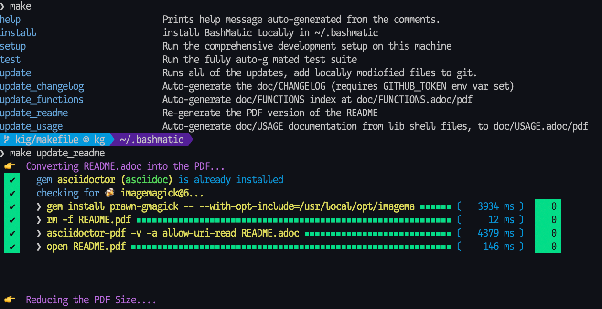

= Bashmatic™ — BASH primitives for humans, and for fun.

:safe: unsafe
:allow-uri-read:
:doctype: book
:toc:
:toclevels: 3
:sectnums: 

image:https://github.com/kigster/bashmatic/workflows/CI/badge.svg[CI Status,link="https://github.com/kigster/bashmatic/actions?query=workflow%3ACI"]
image:https://app.fossa.com/api/projects/git%2Bgithub.com%2Fkigster%2Fbashmatic.svg?type=shield[License Status,link=https://app.fossa.com/projects/git%2Bgithub.com%2Fkigster%2Fbashmatic?ref=badge_shield]
image:https://badges.gitter.im/kigster/bashmatic.svg[link="https://gitter.im/kigster/bashmatic?utm_source=badge&utm_medium=badge&utm_campaign=pr-badge&utm_content=badge"]

image::https://app.fossa.com/api/projects/git%2Bgithub.com%2Fkigster%2Fbashmatic.svg?type=large[FOSSA License Scan,link=https://app.fossa.com/projects/git%2Bgithub.com%2Fkigster%2Fbashmatic?ref=badge_large]

WARNING: 
====
* _Bashmatic®_ is a collection of BASH convenience functions that make BASH programming fun (again? forever? always?).

* You can also download the **xref:README.pdf[PDF version of this document]** which is better for print. 

* We recently began providing function documentation using a fork of `shdoc` utility. You can find the auto-generated documentation in the xref:doc/USAGE.adoc[USAGE.adoc] file, or it's xref:doc/USAGE.pdf[PDF version].

* There is also an auto-generated file listing the source of every function and module. You can find it xref:doc/FUNCTIONS.adoc[FUNCTIONS.adoc].

* There is also the beginnings of `shdoc`-based documentation, available in the xref:doc/./USAGE.adoc[USAGE.adoc] file and a corresponding xref:doc/./USAGE.pdf[PDF].

* Additionally please checkout the xref:doc/CHANGELOG.md[CHANGELOG] and the xref:doc/LICENSE.adoc[LICENSE].
====

IMPORTANT:
====
**Fully Supported**

* BASH version 4+
* BASH version 3 (partial compatibility, some functions are disabled)
* ZSH —— as of recent update, Bashmatic is almost 100% compatible with ZSH.   

**Not Really Supported**

* FISH (although you could use Bashmatic via `bin/bashmatic` script helper, or its executables)

====

_Bashmatic®_ is an ever-growing framework of Bash Script runners, auto-retrying, repeatable, DSL-controlled functions for every occasion, from drawing boxes, lines, headers, to showing progress bars, getting user input, and more.

*_Bashmatic®_ is meant to be used primarily with Mac OS-X, although many useful functions will also work under Linux.* Note that our CI test suite runs on Ubuntu.

Start exploring _Bashmatic®_ below with our examples section. When you are ready, the complete entire set of pubic functions (nearly 500 of those) can be found in the xref:doc/FUNCTIONS.adoc[functions index page].

And, finally, don't worry, *_Bashmatic®_* is totally open source and free to use and extend. We just like the way it looks with a little *®* 😂.

== Project Motivation

This project was born out of a simple realization made by several very senior and highly experienced engineers, that:

* It is often easier to use BASH for writing things like universal *installers*, a.k.a. *setup scripts*, *uploaders*, wrappers for all sorts of functionality, such as *NPM*, *rbenv*, installing gems, rubies, using AWS, deploying code, etc.
* BASH function's return values lend themselves nicely to a compact DSL (https://en.wikipedia.org/wiki/Domain-specific_language[domain specific language]) where multiple functions can be chained by logical AND `&&` and OR `||` to provide a very compact execution logic. Most importantly, we think that this logic is *extremely easy to read and understand.*

Despite the above points, it is also generally accepted that:

* A lot of BASH scripts are very poorly written and hard to read and understand.
* It's often difficult to understand what the hell is going on while the script is running, because either its not outputting anything useful, OR it's outputting way too much.
* When BASH errors occur, shit generally hits the fan and someone decides that they should rewrite the 20-line BASH script in C{pp} or Go, because, well, it's a goddamn BASH script and it ain't working.

IMPORTANT: _Bashmatic_'s goal is to make BASH programming both fun, consistent, and provide plenty of visible output to the user so that there is no mystery as to what is going on.


== Installing Bashmatic

Perhaps the easiest way to install _Bashmatic®_ is using this boot-strapping script.

=== Bootstrapping _Bashmatic®_ using `curl`

First, make sure that you have Curl installed, run `which curl` to see. Then copy/paste this command into your Terminal.

NOTE: The shortcut link resolves to the HEAD version of the https://raw.githubusercontent.com/kigster/bashmatic/master/bin/bashmatic-install[`bin/bashmatic-install`] script in Bashmatic Repo.

[source,bash]
----
bash -c "$(curl -fsSL https://bashmatic.re1.re); bashmatic-install"
----

 * If you prefer to see detailed output about what the installer is doing, add the `-v` (or `--verbose`) flag.
 * If you prefer to install Bashmatic in a non-standard location (the default is `~/.bashmatic`),  you can use the `-H PATH` flag.

For instance:

[source,bash]
----
bash -c "$(curl -fsSL https://bashmatic.re1.re); bashmatic-install -v -H ~/workspace/bashmatic"
----

Here is the complete list of options accepted by the installer:

[source,bash]
----
$ bin/bashmatic-install -h

USAGE:
  bin/bashmatic-install [ flags ]

DESCRIPTION:
  Install Bashmatic, and on OSX also installs build tools, brew and latest bash
  into /usr/local/bin/bash.

FLAGS:
  -H, --bashmatic-home PATH   (default: /Users/kig/.bashmatic)
  -V, --bash-version VERSION  BASH VERSION (default: 5.1-rc2)
  -P, --bash-prefix PATH      BASH into PATH (default: /usr/local)
  -g, --skip-git              Do not abort if bashmatic home has local changes
  -v, --verbose               See additional output.
  -d, --debug                 Turn on 'set -x' to see all commands running.
  -h, --help                  Show this help message.
----

=== What Installer Does

When you run `bash -c "$(curl -fsSL https://bashmatic.re1.re); bashmatic-install"`, the following typically happens:

* `curl` downloads the `bin/bashmatic-install` script and passes it to the built-in BASH for evaluation.
* Once evaluated, function `bashmatic-install` is invoked, which actually performs the installation.
** This is the function that accepts the above listed arguments.
* The script may ask for your password to enable sudo access — this may be required on OS-X to install XCode Developer tools (which include `git`)
* If your version of BASH is 3 or older, the script will download and build from sources version 5+ of BASH,  and install it into `/usr/local/bin/bash`. SUDO may be required for this step.
* On OS-X the script will install Homebrew on OS-X, if not already there.
** Once Brew is installed, brew packages `coreutils` and `gnu-sed` are installed, as both are required and are relied upon by Bashmatic.
* The script will then attempt to `git clone` the bashmatic repo into the Bashmatic home folder, or — if it already exists — it will `git pull` latest changes.
* Finally, the script will check your bash dot files, and will add the hook to load Bashmatic from either `~/.bashrc` or `~/.bash_profile`.

Restart your shell, and make sure that when you type `bashmatic.version` in the command line (and press Enter) you see the version number printed like so:

[source,bash]
----
$ bashmatic.version
1.7.0
----

If you get an error, perhaps _Bashmatic®_ did not properly install.

Next, to discover the breadth of available functions, type the following command to see all imported shell functions:

[source,bash]
----
# Numeric argument specifies the number of columns to use for output
$ bashmatic.functions 3 
----

=== Manual Installation

To install Bashmatic manually, follow these steps (feel free to change `BASHMATIC_HOME` if you like):

[source,bash]
----
export BASHMATIC_HOME="${HOME}/.bashmatic"
test -d "${BASHMATIC_HOME}" || \
  git clone https://github.com/kigster/bashmatic.git \
  "${BASHMATIC_HOME}"
cd "${BASHMATIC_HOME}" && ./bin/bashmatic-install -v
cd ->/dev/null
----

=== Reloading Bashmatic

You can always reload _Bashmatic®_ with `bashmatic.reload` function.

== Using the `Makefile`

The top-level `Makefile` is mostly provided as a convenience around scripts that auto-generate documentation.

You can run `make help` and read the available targets:



You might want to use the Makefile for two reasons:

 * To update function index, or re-generate latest PDFs of README, USAGE or the CHANGELOG files
 * To run tests `make test -B ` does the trick
 * To run a local computer setup with `make setup` :) 

== Bashmatic in Action — Practical Examples

**Why do we need another BASH framework?**

BASH is know to be too verbose and unreliable. We beg to differ. This is why we wanted to start this README with a couple of examples.

=== Example (A): Install Gems via Homebrew

Just look at this tiny, five-line script:

[source,bash]
----
#!/usr/bin/env bash

source ${BASHMATIC_HOME}/init.sh

h2 "Installing ruby gem sym and brew package curl..." \
   "Please standby..."

gem.install "sym" && brew.install.package "curl" && \
  success "installed sym ruby gem, version $(gem.version sym)"
----

Results in this detailed and, let's be honest, _gorgeous_ ASCII output:

image::doc/img/bashmatic-example.png[example,width=100%]

Tell me you are not at all excited to start writing complex installation flows in BASH right away?

Not only you get pretty output, but you can each executed command, it's exit status, whether it's been successful (green/red), as well each command's bloody duration in milliseconds. What's not to like?!? 😂

Still not convinced?

Take a look at a more comprehensive example next.

=== Example (B): Download and install binaries.

In this example, we'll download and install binaries `kubectl` and `minikube` binaries into `/usr/local/bin`

We provided an example script in link:examples/k8s-installer.sh[`examples/k8s-installer.sh`]. Please click and take a look at the source.

Here is the output of running this script:

image::.k8installer.png[.k8installer.png,width=100%]

Why do we think this type of installer is pretty awesome, compared to a silent but deadly shell script that "Jim-in-the-corner" wrote and now nobody understands?

Because:

. The script goes out of its way to over-communicate what it does to the user.
. It allows and reminds about a clean getaway (Ctrl-C)
. It shares the exact command it runs and its timings so that you can eyeball issues like network congestions or network addresses, etc.
. It shows in green exit code '0' of each command. Should any of the commands fail, you'll see it in red.
. It's source code is terse, explicit, and easy to read. There is no magic. Just BASH functions.

NOTE: If you need to create a BASH installer, _Bashmatic®_ offers some incredible time savers.

Let's get back to the Earth, and talk about how to install Bashmatic, and how to use it in more detail right after.


=== Example ++(C)++: Developer Environment Bootstrap Script

This final and most feature-rich example is not just an example -- **it's a working functioning tool that can be used to install a bunch of developer dependencies on your Apple Laptop**.

NOTE: the script relies on Homebrew behind the scenes, and therefore would not work on Linux or Windows (unless Brew gets ported there).

It's located in https://github.com/kigster/bashmatic/blob/master/bin/dev-setup[`bin/dev-setup`] and has many CLI flags:

image::doc/img/dev-setup.png[Developer Setup,width=100%]

In the example below we'll use `dev-setup` script to install the following:
 
* Dev Tools
* PostgreSQL 
* Redis
* Memcached 
* Ruby 2.7.1
* NodeJS/NPM/Yarn

Despite that this is a long list, we can install it all in one command.

We'll run this from a folder where our application is installed, because then the Ruby Version will be auto-detected from our `.ruby-version` file, and in addition to installing all the dependencies the script will also run `bundle install` and `npm install` (or `yarn install`). Not bad, huh?

[source,bash]
----
${BASHMATIC_HOME}/bin/dev-setup \
  -g "ruby postgres mysql caching js monitoring" \
  -r $(cat .ruby-version) \
  -p 9.5 \ # use PostgreSQL version 9.5
  -m 5.6   # use MySQL version 5.6
----

This compact command line installs a ton of things, but don't take our word for it — run it yourself. Or, at the very least enjoy this https://github.com/kigster/bashmatic/blob/master/.dev-setup-completed.png[one extremely long screenshot] :)


=== Example (D): Installing GRC Colourify Tool

This is a great tool that colorizes nearly any other tool's output.

Run it like so:

[source,bash]
${BASHMATIC_HOME}/bin/install-grc

You might need to enter your password for SUDO.

Once it completes, run `source ~/.bashrc` (or whatever shell you use), and type something like `ls -al` or `netstat -rn` or `ping 1.1.1.1` and notice how all of the above is nicely colored.


=== Example (E): Database Utilities & `dbtop`

If you are using PostgreSQL, you are in luck! Bashmatic includes numerous helpers for PostreSQL's CLI
utility `psql`.

Before you begin, we recommend that you install file `.psqlrc` from Bashmatic's `conf` directory into your home folder. While not required, this file sets up your prompt and various macros for PostgreSQL that will come very handy if you use `psql` with any regularity.

What is `dbtop` anyway?

Just like with the regular `top` you can see the "top" resource-consuming processes running on your local system, with `dbtop` you can observe a self-refreshing report of the actively running queries on up to *three database servers* at the same time.

Here is the pixelated screenshot of `dbtop` running against two live databases:

image::doc/img/dbtop.png[DBTop Example,width=90%,align=center,link="https://github.com/kigster/bashmatic/blob/master/FUNCTIONS.adoc#db-top"]

In order for this to work, you must first define database connection parameters in a YAML file located at the following PATH: `~/.db/database.yml`.

Here is how the file should be organized (if you ever used Ruby on Rails, the standard `config/database.yml` file should be fully compatible):

[source,yaml]
----
development:
  database: development
  username: postgres
  host: localhost
  password: 
staging:
  database: staging
  username: postgres
  host: staging.db.example.com
  password: 
production:
  database: production
  username: postgres
  host: production.db.example.com
  password: "a098098safdaf0998ff79789a798a7sdf"
----

Given the above file, you should be able to run:

[source,bash]
$ db connections

And see the newline separated list:

```
development
staging
production
```

Once that's working, you should be able run `dbtop`:

[source,bash]
----
db top development staging production
----

NOTE: At the moment, only the default port 5432 is supported. If you are using an alternative port, and as long as it's shared across the connections you can set the `PGPORT` environment variable that `psql` will read.

**DB Top Configuration**:

You can configure the following settings for `db top`:

1. You can change the location of the `database.yml` file with `db.config.set-file <filepath>`
2. You can change the refresh rate of the `dbtop` with eg. `db.top.set-refresh 0.5` (in seconds, fractional values allowed). This sets the sleep time between the screen is fully refreshed.

== Usage

Welcome to *Bashmatic* -- an ever growing collection of scripts and mini-bash frameworks for doing all sorts of things quickly and efficiently.

We have adopted the https://google.github.io/styleguide/shell.xml[Google Bash Style Guide], and it's recommended that anyone committing to this repo reads the guides to understand the conventions, gotchas and anti-patterns.

=== Function Naming Convention Unpacked

_Bashmatic®_ provides a large number of functions, which are all loaded in your current shell. The functions are split into two fundamental groups:

* Functions with names beginning with a `.` are considered "private" functions, for example `.run.env` and `.run.initializer`
* All other functions are considered public.

The following conventions apply to all functions:

* We use the "dot" for separating namespaces, hence `git.sync` and `gem.install`.
* Function names should be self-explanatory and easy to read.
* DO NOT abbreviate words.
* All public functions must be written defensively: i.e. if the function is called from the Terminal without any arguments, and it requires arguments, the function _must print its usage info_ and a meaningful error message.

For instance:

[source,bash]
----
$ gem.install
┌─────────────────────────────────────────────────────────┐
│  « ERROR »  Error — gem name is required as an argument │
└─────────────────────────────────────────────────────────┘
----

Now let's run it properly:

[source,bash]
----
$ gem.install simple-feed
       installing simple-feed (latest)...
  ✔︎    $ gem install simple-feed   ▪▪▪▪▪▪▪▪▪▪▪▪▪▪▪▪▪▪▪▪▪〔   5685 ms 〕    0
  ✔︎    $ gem list > ${BASHMATIC_TEMP}/.gem/gem.list ▪▪▪▪▪▪〔    503 ms 〕    0
----

The naming convention we use is a derivative of Google's Bash StyleGuide, using `.` to separate BASH function namespaces instead of much more verbose `::`.

=== Seeing All Functions

After running the above, run `bashmatic.functions` function to see all available functions. You can also open the xref:doc/FUNCTIONS.adoc[FUNCTIONS.adoc] file to see the alphabetized list of all 422 functions.

=== Seeing Specific Functions

To get a list of module or pattern-specific functions installed by the framework, run the following:

[source,bash]
----
$ bashmatic.functions-from pattern [ columns ]
----

For instance:

[source,bash]
----
$ bashmatic.functions-from docker 2
docker.abort-if-down                    docker.build.container
docker.actions.build                    docker.containers.clean
.......
docker.actions.update
----

=== Various Modules

You can list various modules by listing the `lib` sub-directory of the `${BASHMATIC_HOME}` folder.

Note how we use _Bashmatic®_ helper `columnize [ columns ]` to display a long list in five columns.

[source,bash]
----
$ ls -1 ${BASHMATIC_HOME}/lib | sed 's/\.sh//g' | columnize 5
7z                deploy            jemalloc          runtime-config    time
array             dir               json              runtime           trap
audio             docker            net               set               url
aws               file              osx               set               user
bashmatic         ftrace            output            settings          util
brew              gem               pids              shell-set         vim
caller            git-recurse-updat progress-bar      ssh               yaml
color             git               ruby              subshell
db                sedx              run               sym
----

=== Key Modules Explained

At a high level, the following modules are provided, in order of importance:

==== 1. Runtime

The following files provide this functionality:

* `lib/run.sh`
* `lib/runtime.sh`
* `lib/runtime-config.sh`.

These collectively offer the following functions:

[source,bash]
----
$ bashmatic.functions-from 'run*'

run                                            run.set-next
run.config.detail-is-enabled                   run.set-next.list
run.config.verbose-is-enabled                  run.ui.ask
run.inspect                                    run.ui.ask-user-value
run.inspect-variable                           run.ui.get-user-value
run.inspect-variables                          run.ui.press-any-key
run.inspect-variables-that-are                 run.ui.retry-command
run.inspect.set-skip-false-or-blank            run.variables-ending-with
run.on-error.ask-is-enabled                    run.variables-starting-with
run.print-variable                             run.with.minimum-duration
run.print-variables                            run.with.ruby-bundle
run.set-all                                    run.with.ruby-bundle-and-output
run.set-all.list
----

Using these functions you can write powerful shell scripts that display each command they run, it's status, duration, and can abort on various conditions. You can ask the user to confirm, and you can show a user message and wait for any key pressed to continue.

===== Runtime Framework in Depth

One of the core tenets of this library is it's "runtime" framework, which offers a way to run and display commands as they run, while having a fine-grained control over the following:

* What happens when one of the commands fails? Options include:
 ** Ignore and continue (default) -- _continue-on-error_
 ** Ask the user if she wants to proceed -- _ask-on-error_
 ** Abort the entire run -- _abort-on-error_.
* How is command output displayed?
 ** Is it swallowed for compactness, and only shown if there is an error? (default) -- _show-output-off_
 ** Or is it shown regardless? -- _show-output-on_
* Should commands actually run (_dry-run-off_), or simply be printed? (_dry-run-on_).

===== Examples of Runtime Framework

____
NOTE, in the following examples we assume you installed the library into your project's folder as `.bashmatic` (a "hidden" folder starting with a dot).
____

Programming style used in this project lends itself nicely to using a DSL-like approach to shell programming.  For example, in order to configure the behavior of the run-time framework (see below) you would run the following command:

[source,bash]
----
#!/usr/bin/env bash

# (See below on the location of .bashmatic and ways to install it)
source ${BASHMATIC_HOME}/init.sh

# configure global behavior of all run() invocations
run.set-all abort-on-error show-output-off

run "git clone https://gthub.com/user/rails-repo rails"
run "cd rails"
run "bundle check || bundle install"

# the following configuration only applies to the next invocation of `run()`
# and then resets back to `off`
run.set-next show-output-on
run "bundle exec rspec"
----

And most importantly, you can use our fancy UI drawing routines to communicate with the user, which are based on familiar HTML constructs, such as `h1`, `h2`, `hr`, etc.

==== 2. Output Modules

The `lib/output.sh` module does all of the heavy lifting with providing many UI elements, such as frames, boxes, lines, headers, and many more.

Here is the list of functions in this module:

[source,bash]
----
$ bashmatic.functions-from output 3
abort                          error:                         left-prefix
ascii-clean                    h.black                        ok
box.blue-in-green              h.blue                         okay
box.blue-in-yellow             h.green                        output.color.off
box.green-in-cyan              h.red                          output.color.on
box.green-in-green             h.yellow                       output.is-pipe
box.green-in-magenta           h1                             output.is-redirect
box.green-in-yellow            h1.blue                        output.is-ssh
box.magenta-in-blue            h1.green                       output.is-terminal
box.magenta-in-green           h1.purple                      output.is-tty
box.red-in-magenta             h1.red                         puts
box.red-in-red                 h1.yellow                      reset-color
box.red-in-yellow              h2                             reset-color:
box.yellow-in-blue             h2.green                       screen-width
box.yellow-in-red              h3                             screen.height
box.yellow-in-yellow           hdr                            screen.width
br                             hl.blue                        shutdown
center                         hl.desc                        stderr
columnize                      hl.green                       stdout
command-spacer                 hl.orange                      success
cursor.at.x                    hl.subtle                      test-group
cursor.at.y                    hl.white-on-orange             ui.closer.kind-of-ok
cursor.down                    hl.white-on-salmon             ui.closer.kind-of-ok:
cursor.left                    hl.yellow                      ui.closer.not-ok
cursor.rewind                  hl.yellow-on-gray              ui.closer.not-ok:
cursor.right                   hr                             ui.closer.ok:
cursor.up                      hr.colored                     warn
debug                          inf                            warning
duration                       info                           warning:
err                            info:
error                          left
----

Note that some function names end with `:` -- this indicates that the function outputs a new-line in the end. These functions typically exist together with their non-`:`-terminated counter-parts.  If you use one, eg, `inf`, you are then supposed to finish the line by providing an additional output call, most commonly it will be one of `ok:`, `ui.closer.not-ok:` and `ui.closer.kind-of-ok:`.

Here is an example:

[source,bash]
----
function valid-cask()  { sleep 1; return 0; }
function verify-cask() {
  inf "verifying brew cask ${1}...."
  if valid-cask ${1}; then
    ok:
  else
    not-ok:
  fi
}
----

When you run this, you should see something like this:

[source,bash]
----
 $ verify-cask TextMate
  ✔︎    verifying brew cask TextMate....
----

In the above example, you see the checkbox appear to the left of the text. In fact, it appears a second after, right as `sleep 1` returns. This is because this paradigm is meant for wrapping constructs that might succeed or fail.

If we change the `valid-cask` function to return a failure:

[source,bash]
----
function valid-cask()  { sleep 1; return 1; }
----

Then this is what we'd see:

[source,bash]
----
$ verify-cask TextMate
  ✘    verifying brew cask TextMate....
----

===== Output Components

Components are BASH functions that draw something concrete on the screen. For instance, all functions starting with `box.` are components, as are `h1`, `h2`, `hr`, `br` and more.

[source,bash]
----
$ h1 Hello

┌───────────────────┐
│ Hello             │
└───────────────────┘
----

These are often named after HTML elements, such as `hr`, `h1`, `h2`, etc.

===== Output Helpers

Here is another example where we are deciding whether to print something based on whether the output is a proper terminal (and not a pipe or redirect):

----
output.is-tty && h1 "Yay For Terminals!"
output.has-stdin && echo "We are being piped into..."
----

The above reads more like a high level language like Ruby or Python than Shell. That's because BASH is more powerful than most people think.

There is an link:examples/test-ui.sh[example script] that demonstrates the capabilities of Bashmatic.

If you ran the script, you should see the output shown link:.bashmatic.png[in this screenshot]. Your colors may vary depending on what color scheme and font you use for your terminal.

==== 3. Package management: Brew and RubyGems

You can reliably install ruby gems or brew packages with the following syntax:

[source,bash]
----
#!/usr/bin/env bash

source ${BASHMATIC_HOME}/init.sh

h2 "Installing ruby gem sym and brew package curl..." \
   "Please standby..."

gem.install sym
brew.install.package curl

success "installed Sym version $(gem.version sym)"
----

When you run the above script, you shyould seee the following output:

image::doc/img/bashmatic-example.png[example]

==== 4. Shortening URLs and Github Access

You can shorten URLs on the command line using Bitly, but for this to work, you must set the following environment variables in your shell init:

[source,bash]
----
export BITLY_LOGIN="<your login>"
export BITLY_API_KEY="<your api key>"
----

Then you can run it like so:

[source,bash]
----
$ url.shorten https://raw.githubusercontent.com/kigster/bashmatic/master/bin/install
# http://bit.ly/2IIPNE1
----

===== Github Access

There are a couple of Github-specific helpers:

[source,bash]
----
github.clone                  github.setup
github.org                    github.validate
----

For instance:

[source,bash]
----
$ github.clone sym

  ✘    Validating Github Configuration...

       Please enter the name of your Github Organization:
       $ kigster

  Your github organization was saved in your ~/.gitconfig file.
  To change it in the future, run: 

       $ github.org <org-name>

  ✔︎ $ git clone git@github.com:kigster/sym ▪▪▪▪▪▪〔     931 ms 〕  
----

==== 5. File Helpers

[source,bash]
----
$ bashmatic.functions-from file

file.exists_and_newer_than     file.list.filter-non-empty
file.gsub                      file.size
file.install-with-backup       file.size.mb
file.last-modified-date        file.source-if-exists
file.last-modified-year        file.stat
file.list.filter-existing
----

For instance, `file.stat` offers access to the `fstat()` C-function:

[source,bash]
----
 $ file.stat README.md st_size
22799
----

==== 6. Array Helpers

[source,bash]
----
$ bashmatic.functions-from array

array.to.bullet-list         array.includes
array.has-element            array.includes-or-exit
array.to.csv                 array.from.stdin
array-join                   array.join
array-piped                  array.to.piped-list
array.includes-or-complain
----

For instance:

[source,bash]
----
$ declare -a farm_animals=(chicken duck rooster pig)
$ array.to.bullet-list ${farm_animals[@]}
 • chicken
 • duck
 • rooster
 • pig
$ array.includes "duck" "${farm_animals[@]}" && echo Yes || echo No
Yes
$ array.includes  "cow" "${farm_animals[@]}" && echo Yes || echo No
No
----

==== 7. Utilities

The utilities module has the following functions:

[source,bash]
----
$ bashmatic.functions-from util

pause.long                                    util.install-direnv
pause                                         util.is-a-function
pause.short                                   util.is-numeric
pause.medium                                  util.is-variable-defined
util.append-to-init-files                     util.lines-in-folder
util.arch                                     util.remove-from-init-files
util.call-if-function                         util.shell-init-files
util.checksum.files                           util.shell-name
util.checksum.stdin                           util.ver-to-i
util.functions-starting-with                  util.whats-installed
util.generate-password                        watch.ls-al
----

For example, version helpers can be very handy in automated version detection, sorting and identifying the latest or the oldest versions:

[source,bash]
----
$ util.ver-to-i '12.4.9'
112004009
$ util.i-to-ver $(util.ver-to-i '12.4.9')
12.4.9
----

==== 8. Ruby and Ruby Gems

Ruby helpers abound:

[source,bash]
----
$ bashmatic.functions-from ruby

bundle.gems-with-c-extensions                 ruby.install-ruby-with-deps
interrupted                                   ruby.install-upgrade-bundler
ruby.bundler-version                          ruby.installed-gems
ruby.compiled-with                            ruby.kigs-gems
ruby.default-gems                             ruby.linked-libs
ruby.full-version                             ruby.numeric-version
ruby.gemfile-lock-version                     ruby.rbenv
ruby.gems                                     ruby.rubygems-update
ruby.gems.install                             ruby.stop
ruby.gems.uninstall                           ruby.top-versions
ruby.init                                     ruby.top-versions-as-yaml
ruby.install                                  ruby.validate-version
ruby.install-ruby
----

From the obvious `ruby.install-ruby <version>` to incredibly useful `ruby.top-versions <platform>` -- which, using rbenv and ruby_build plugin, returns the most recent minor version of each major version upgrade, as well as the YAML version that allows you to pipe the output into your `.travis.yml` to test against each major version of Ruby, locked to the very latest update in each.

[source,bash]
----
$ ruby.top-versions
2.0.0-p648
2.1.10
2.2.10
2.3.8
2.4.9
2.5.7
2.6.5
2.7.0
2.8.0-dev

$ ruby.top-versions jruby
jruby-1.5.6
jruby-1.6.8
jruby-1.7.27
jruby-9.0.5.0
jruby-9.1.17.0
jruby-9.2.10.0

$ ruby.top-versions mruby
mruby-dev
mruby-1.0.0
mruby-1.1.0
mruby-1.2.0
mruby-1.3.0
mruby-1.4.1
mruby-2.0.1
mruby-2.1.0
----

===== Gem Helpers

These are fun helpers to assist in scripting gem management.

[source,bash]
----
$ bashmatic.functions-from gem

g-i                                           gem.gemfile.version
g-u                                           gem.global.latest-version
gem.cache-installed                           gem.global.versions
gem.cache-refresh                             gem.install
gem.clear-cache                               gem.is-installed
gem.configure-cache                           gem.uninstall
gem.ensure-gem-version                        gem.version
----

For instance

[source,bash]
----
$ g-i awesome_print
  ✔︎    gem awesome_print (1.8.0) is already installed
$ gem.version awesome_print
1.8.0
----

==== 9. Additional Helpers

There are plenty more modules, that help with:

* link:lib/ruby.sh[Ruby Version Helpers] and (Ruby Gem Helpers)[lib/gem.sh], that can extract curren gem version from either `Gemfile.lock` or globally installed gem list..
* link:lib/aws.sh[AWS helpers] -- requires `awscli` and credentials setup, and offers some helpers to simplify AWS management.
* link:lib/docker.sh[Docker Helpers] -- assist with docker image building and pushing/pulling
* link:lib/sym.sh[Sym] -- encryption with the gem called https://github.com/kigster/sym[`sym`]

And many more.

See the full function index with the function implementation body in the xref:doc/FUNCTIONS.adoc[FUNCTIONS.adoc] index.

'''

== How To...

=== Write new DSL in the _Bashmatic®_ Style

The following example is the actual code from a soon to be integrated AWS credentials install script. This code below checks that a user has a local `~/.aws/credentials` file needed by the `awscli`, and in the right INI format. If it doesn't find it, it checks for the access key CSV file in the `~/Downloads` folder, and converts that if found. Now, if even that is not found, it prompts the user with instructions on how to generate a new key pair on AWS IAM website, and download it locally, thereby quickly converting and installing it as a proper credentials file. Not bad, for a compact BASH script, right? (of course, you are not seeing all of the involved functions, only the public ones).

[source,bash]
----
# define a new function in AWS namespace, related to credentials.
# name of the function is self-explanatory: it validates credentials
# and exits if they are invalid.
aws.credentials.validate-or-exit() {
  aws.credentials.are-valid || {
    aws.credentials.install-if-missing || bashmatic.exit-or-return 1
  }
}

aws.credentials.install-if-missing() {
  aws.credentials.are-present || { # if not present
    aws.access-key.is-present || aws.access-key.download # attempt to download the key
    aws.access-key.is-present && aws.credentials.check-downloads-folder # attempt to find it in ~/Downloads
  }

  aws.credentials.are-present || { # final check after all attempts to install credentials
    error "Unable to find AWS credentials. Please try again." && bashmatic.exit-or-return 1
  }

   bashmatic.exit-or-return 0
}
----

Now, *how would you use it in a script?* Let's say you need a script to upload
something to AWS S3. But before you begin, wouldn't it be nice to verify
that the credentials exist, and if not -- help the user install it? Yes it would.

And that is exactly what the code above does, but it looks like a DSL. because
it _is_ a DSL.

This script could be your `bin/s3-uploader`

[source, bash]
----
aws.credentials.validate-or-exit
# if we are here, that means that AWS credentials have been found.
# and we can continue with our script.
----


### How can I test if the function was ran as part of a script, or "sourced-in"?

Some bash files exists as libraries to be "sourced in", and others exist as scripts to be run. But users won't always know what is what, and may try to source in a script that should be run, or vice versa — run a script that should be sourced in.

What do you, programmer, do to educate the user about correct usage of your script/library?

_Bashmatic®_ offers a reliable way to test this:

[source,bash]
----
#!/usr/bin/env bash
# load library
if [[ -f "${Bashmatic__Init}" ]]; then source "${Bashmatic__Init}"; else source ${BASHMATIC_HOME}/init.sh; fi
bashmatic.validate-subshell || return 1
----

If you'rather require a library to be sourced in, but not run, use the code as follows:

[source,bash]
----
#!/usr/bin/env bash
# load library
if [[ -f "${Bashmatic__Init}" ]]; then source "${Bashmatic__Init}"; else source ${BASHMATIC_HOME}/init.sh; fi
bashmatic.validate-sourced-in || exit 1
----


=== How do I run unit tests for Bashmatic?

The framework comes with a bunch of automated unit tests based on the fantastic framework https://github.com/sstephenson/bats.git[`bats`].

To run all tests:

[source,bash]
----
cd ${BASHMATIC_HOME}
bin/specs
----

While not every single function is tested (far from it), we do try to add tests to the critical ones.

Please see https://github.com/kigster/bashmatic/tree/master/test[existing tests] for the examples.

=== How can I change the underscan or overscan for an old monitor?

If you are stuck working on a monitor that does not support switching digit input from TV to PC, NOR does OS-X show the "underscan" slider in the Display Preferences, you may be forced to change the underscan manually. The process is a bit tricky, but we have a helpful script to do that:

[source,bash]
----
$ source init.sh
$ change-underscan 5
----

This will reduce underscan by 5% compared to the current value. The total value is 10000, and is stored in the file `/var/db/.com.apple.iokit.graphics`. The tricky part is determining which of the display entries map to your problem monitor. This is what the script helps with.

Do not forget to restart after the change.

Acknowledgements: the script is an automation of the method offered on http://ishan.co/external-monitor-underscan[this blog post].

=== Contributing

Submit a pull request!

## License

This project is distributed under the MIT License.


