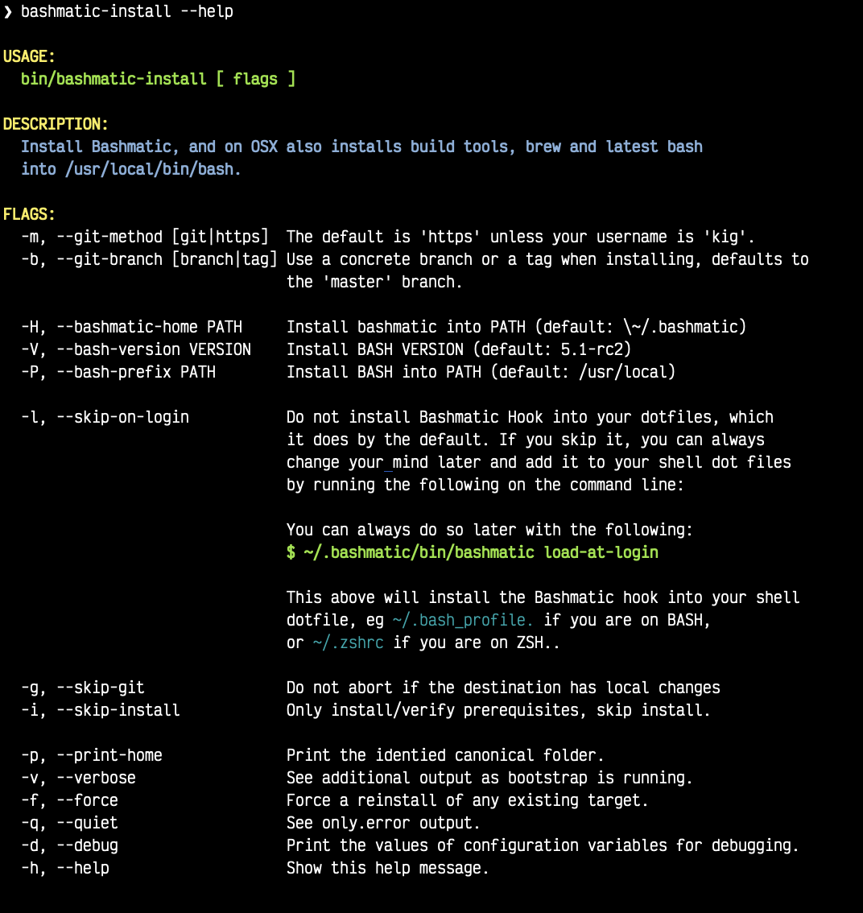
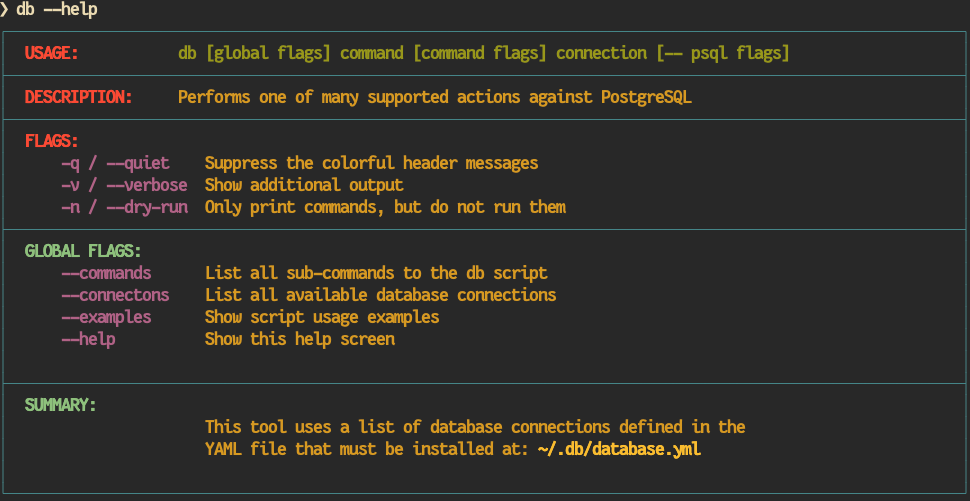
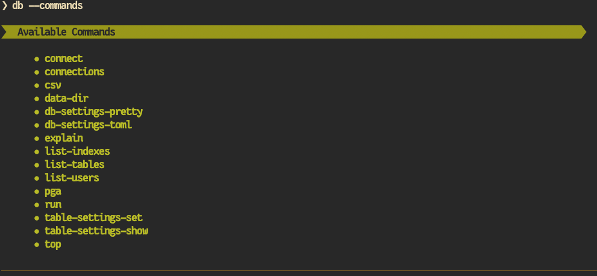
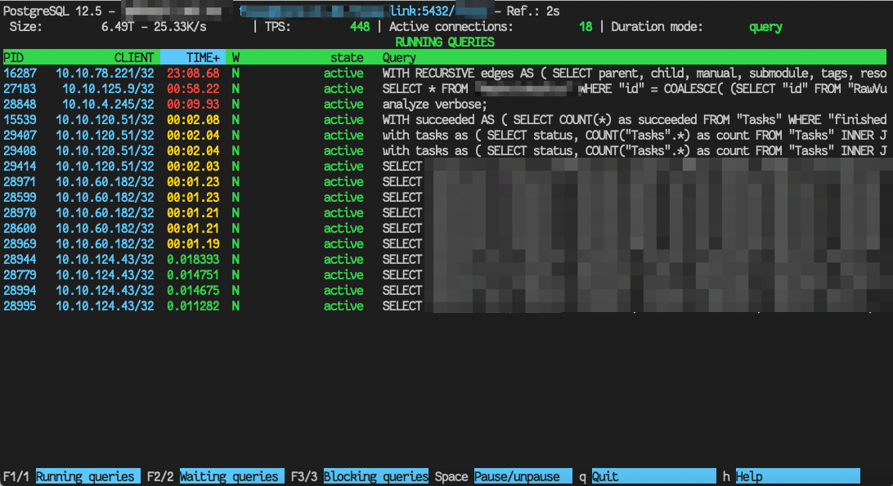
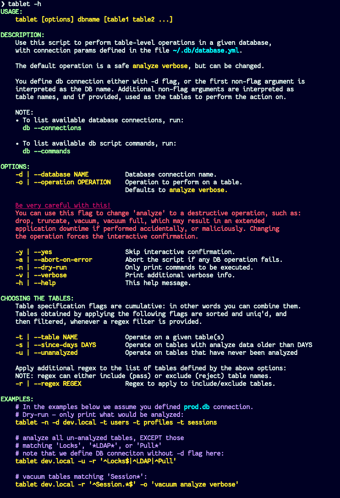

[separator=—]
= Bashmatic® — BASH-based DSL helpers for humans, sysadmins, and fun.
// vim: ft=asciidoc
:author: Version v3.0.5
:doctype: book
:source-highlighter: rouge
:rouge-style: base16.monokai
:toclevels: 5
:toc:
:sectnums: 9
:icons: font
:license: MIT


== CI Matrix

.CI Matrix
[width="80%",cols=">.^s,<.^m,^.^s",frame="topbot",options="header,footer"]
|==========================
|                    | Badges  |  FOSSA Scanning
| FOSSSA             | image:https://app.fossa.com/api/projects/git%2Bgithub.com%2Fkigster%2Fbashmatic.svg?type=shield[License Status,link=https://app.fossa.com/projects/git%2Bgithub.com%2Fkigster%2Fbashmatic?ref=badge_shield] .7+<.>| image:https://app.fossa.com/api/projects/git%2Bgithub.com%2Fkigster%2Fbashmatic.svg?type=large[FOSSA License Scan,link=https://app.fossa.com/projects/git%2Bgithub.com%2Fkigster%2Fbashmatic?ref=badge_large] 
| CI Tests           | image:https://github.com/kigster/bashmatic/actions/workflows/tests.yml/badge.svg[Test,link=https://github.com/kigster/bashmatic/actions/workflows/tests.yml]                 
| ShellCheck         | image:https://github.com/kigster/bashmatic/actions/workflows/lint.yml/badge.svg[Lint,link=https://github.com/kigster/bashmatic/actions/workflows/lint.yml]                 
| Gitter             | image:https://badges.gitter.im/kigster/bashmatic.svg[link="https://gitter.im/kigster/bashmatic?utm_source=badge&utm_medium=badge&utm_campaign=pr-badge&utm_content=badge"]
|==========================


== Introduction 

_Bashmatic®_ is a BASH framework, meaning its a collection of BASH functions (500+ of them) that, we hope, make BASH programming easier, more enjoyable, and more importantly, usable due to the focus on providing constant feedback to the user about what is happening, as a script that uses Bashmatic is running.

_Bashmatic®_'s programming style is heavily influenced by Ruby's DSL languages. If you take a quick look at the https://github.com/kigster/bashmatic/blob/master/lib/is.sh[is.sh] script, it defines a bunch of DSL functions that can be chained with `&&`  and `||` to create a compact and self-documenting code like this:

icon:arrow-circle-down[3x, color="purple"]

[source,bash]
----
# An example of a DSL-like function 
function bashmatic.auto-update() {
  local dir="${1:-"${BASHMATIC_HOME"}}"
  is.a-directory "${dir}" && {
    file.exists-and-newer-than "${dir}/.last-update" 30 && return 0
    ( 
      cd ${BASHMATIC_HOME} && \
      git.is-it-time-to-update && \
      git.sync-remote 
    )
  }
}

# check if the function is defined and call it 
is.a-function.invoke bashmatic.auto-update "$@"
----

To use it in your own scripts, you'll want to first study the Examples provided below, and take advantage of ach module available under `lib`.

Final note, - once Bashmatic is installed and loaded by your shell init files, you can type `is.<tab><tab>` to see what functions are available to you that start with `is`. Each module under `lib` typically defines public functions starting with the name of the file. Such as, functions in `array.sh` typically start with `array.<something>.<action>`

_Bashmatic®_ offers a huge range of ever-growing helper functions for running commands, auto-retrying, repeatable, runtime-measuring execution framework with the key function `run`. There are helpers for every occasion, from drawing boxes, lines, headers, to showing progress bars, getting user input, installing packages, and much more.

NOTE: A good portion of the helpers within *_Bashmatic®_ are written for OS-X, although many useful functions will also work under linux.*  Our entire  test suite runs on Ubuntu. There is an effort underway to convert Homebrew-specific functions to OS-neutral helpers such as `package.install` that would work equally well on linux.

Start exploring _Bashmatic®_ below with our examples section. When you are ready, the complete entire set of pubic functions (nearly 500 of those) can be found in the https://github.com/kigster/bashmatic/blob/master/doc/FUNCTIONS.adoc[functions index page].

And, finally, don't worry, *_Bashmatic®_* is totally open source and free to use and extend. We just like the way it looks with a little *®* :) 


[TIP]
====
We suggest that you learn about Bashmatic from the **https://github.com/kigster/bashmatic/blob/master/README.pdf[PDF version of this document]** which is much better for print. 

* We recently began providing function documentation using a fork of `shdoc` utility. You can find the auto-generated documentation in the https://github.com/kigster/bashmatic/blob/master/doc/USAGE.md[USAGE] file, or it's https://github.com/kigster/bashmatic/blob/master/doc/USAGE.pdf[PDF] version.

* There is also an auto-generated file listing the source of every function and module. You can find it https://github.com/kigster/bashmatic/blob/master/doc/FUNCTIONS.adoc[FUNCTIONS].

* Additionally please checkout the https://github.com/kigster/bashmatic/blob/master/doc/CHANGELOG.md[CHANGELOG] and the https://github.com/kigster/bashmatic/blob/master/doc/LICENSE.adoc[LICENSE].
====

=== Compatibility

* BASH version 4+
* BASH version 3 (partial compatibility, some functions are disabled)
* ZSH – as of recent update, Bashmatic is almost 90% compatible with ZSH.   

**Not Currently Supported**

* FISH (although you could use Bashmatic via `bin/bashmatic` script helper, or its executables)

== Project Motivation

This project was born out of a simple realization made by several very senior and highly experienced engineers, that:

* It is often easier to use BASH for writing things like universal *installers*, a.k.a. *setup scripts*, *uploaders*, wrappers for all sorts of functionality, such as *NPM*, *rbenv*, installing gems, rubies, using AWS, deploying code, etc.

* BASH function's return values lend themselves nicely to a compact DSL (https://en.wikipedia.org/wiki/Domain-specific_language[domain specific language]) where multiple functions can be chained by logical AND `&&` and OR `||` to provide a very compact execution logic. Most importantly, we think that this logic is *extremely easy to read and understand.*

Despite the above points, it is also generally accepted that:

* A lot of BASH scripts are very poorly written and hard to read and understand.
* It's often difficult to understand what the hell is going on while the script is running, because either its not outputting anything useful, OR it's outputting way too much.
* When BASH errors occur, shit generally hits the fan and someone decides that they should rewrite the 20-line BASH script in C{pp} or Go, because, well, it's a goddamn BASH script and it ain't working.

TIP: _Bashmatic_'s goal is to make BASH programming both fun, consistent, and provide plenty of visible output to the user so that there is no mystery as to what is going on.

== Installing Bashmatic

Perhaps the easiest way to install _Bashmatic®_ is using `curl` as shown below. 

First, make sure that you have Curl installed, run `which curl` to see. Then copy/paste this command into your Terminal.

=== 1. Automated Install

icon:arrow-down[3x, color="yellow"]

[source,bash]
----
bash -c "$(curl -fsSL https://bashmatic.re1.re); bashmatic-install -q"
----

icon:arrow-up[3x, color="yellow"]

Where: 

* -q stands for "quiet"; 
* -v for "verbose"

TIP: The URL _https://bashmatic.re1.re_ redirects to the HEAD of the https://raw.githubusercontent.com/kigster/bashmatic/master/bin/bashmatic-install[`bin/bashmatic-install`] script in the Github Bashmatic Repo. We use this URL so that we retain the ability to redirect the installation to a different script in the future, if need be.

=== 2. Automated Install, More Explicit

If you prefer to be able to examine the script before executing code piped straight off the Internet, I don't blame you. You are cautious and smart. 

For folks like you, here is a slightly more secure way of doing the same thing:

[source,bash]
----
export script="/tmp/install"
curl -fsSL https://bashmatic.re1.re > /tmp/install
chmod 755  /tmp/install

# At this point you can examine /tmp/install
/tmp/install --help
/tmp/install --verbose --debug # install with extra info
----

This method allows you to examine the `/tmp/install` script before running it.

Below are some of the explanations 

==== Installing a Particular Version or a Branch

You can install a branch or a tag of Bashmatic by passing `-b / --git-branch <tag|branch>` flag.

==== Customizing the Installer Script

You can pass flags to the `bashmatic-install` function to control how, where to Bashmatic is installed, and where from it is downloaded, including:

- `-v` or `--verbose` for displaying additional output, or the opposite: 
- `-d` or `--debug` will print additional debugging output 
- `-f` or `--force` will replace any existing bashmatic folder with the new one
- `-q` or `--quiet` for no output
- `-l` or `--skip-on-login` to NOT install the hook that loads Bashmatic on login.
- If you prefer to install Bashmatic in a non-standard location (the default is `~/.bashmatic`),  you can use the `-H PATH` flag

.Example of a customized installation
====
For instance, here we are installing Bashmatic into a non-default destination, while printing additional verbose & debug information, as well as using `-f` (force) to possibly overwrite the destination folder (if it already exists) with a checkout of Bashmatic according to a tag `v2.4.1`:

[source,bash]
----
bash -c "$(curl -fsSL https://bashmatic.re1.re); \
    bashmatic-install -d -v -f -b v2.4.1 -H ~/workspace/bashmatic"
----

====

If you have your SSH keys installed both locally, and the public key was configured with your account on Github, you might want to install Bashmatic using `git@github.com:kigster/bashmatic` origin, instead of the default `https://github.com/kigster/bashmatic`:


Here is the complete list of options accepted by the installer:



=== Understanding what the Installer Does

When you run `bash -c "$(curl -fsSL https://bashmatic.re1.re); bashmatic-install"`, the following typically happens:

* `curl` downloads the `bin/bashmatic-install` script and passes it to the built-in BASH for evaluation.
* Once evaluated, function `bashmatic-install` is invoked, which actually performs the installation.
** This is the function that accepts the above listed arguments.
* The script may ask for your password to enable sudo access - this may be required on OS-X to install XCode Developer tools (which include `git`)
* If your version of BASH is 3 or older, the script will download and build from sources version 5+ of BASH,  and install it into `/usr/local/bin/bash`. SUDO may be required for this step.
* On OS-X the script will install Homebrew on OS-X, if not already there.
** Once Brew is installed, brew packages `coreutils` and `gnu-sed` are installed, as both are required and are relied upon by Bashmatic.
* The script will then attempt to `git clone` the bashmatic repo into the Bashmatic home folder, or - if it already exists - it will `git pull` latest changes.
* Finally, unless you specify `-l` or `--skip-on-login` the script will check your bash dot files, and will add the hook to load Bashmatic from either `~/.bashrc` or `~/.bash_profile`.

The last part my require some explanation.

==== To load Bashmatic at Login, or Not?

Now, you may or may not want to load Bashmatic on login. 

===== If you load Bashmatic on login (the default installer mode):

In other words, you have something like this in your `~/.bashrc`:

[source,bash]
----
# Let's see if ~/.bashrc mentions Bashmatic:
$ grep bashmatic ~/.bashrc 
[[ -f ~/.bashmatic/init.sh ]] && source ~/.bashmatic/init.sh
----

[ATTENTION]
====
icon:check-circle[fw, color="green"] Pros of loading at login:: Instant access to 800+ convenience functions Bashmatic© offers and helpers. Bashmatic will auto-update whenever its loaded from the master branch.

icon:times-circle[fw, color="red"] Cons of loading at login:: About __134ms__ delay at login, and a potential security attack vector (eg, if someone hacks the repo).

TIP: We recently dramatically improved the loading time of the entirety of Bashmatic© functions. Previously it took nearly 900ms, almost a full second to load 854 functions. Today it's no more than 180ms:

[source,bash]
----
❯ time source init.sh

real  0m0.134s
user  0m0.078s
sys	  0m0.074s
----

====

If the above command shows the output you see above, when you grep your `bashrc` or `zshrc`, then all Bashmatic Functions will be loaded into your shell. This could be very convenient, for instance, 

* you could invoke `ruby.install-ruby-with-readline-and-openssl 3.0.1` to get Ruby installed. 

* You could invoke `gem.remote.version sym` to see that the last published verison of `sym` is `3.0.1`.

* You could join an array of values with with `array.join ", " apple pear orange`

NOTICE: Bashmatic takes no more than 200-300ms to load typically. That said, you might not want to have this many shell functions in your environment, so in that case you can skip login hook by passing `-l` or `--skip-on-login`.

===== If you do not want to load Bashnmatic on login

Install it with:

[source,bash]
----
bash -c "$(curl -fsSL https://bashmatic.re1.re); bashmatic-install -l"
----

In this case we suggest that you simply add the Bashmatic's `bin` folder to the `$PATH`. 

For instance:

[source,bash]
----
# ~/.bashrc
export BASHMATIC_HOME="${HOME}/.bashmatic"
export PATH="${BASHMATIC_HOME}/bin:${PATH}"
----

Then you will have access to the executable script `bashmatic` which can be used **as a "gateway" to all bashmatic functions:*

You use it like so: `bashmatic <function> <args>`:

IMPORTANT: Examples below assume you've set the `PATH` to include `${HOME}/.bashmatic/bin`


[source,bash]
----
# Eg, if as in the previous example you sourced in Bashmatic:
$ bashmatic.version
2.1.2

# If you have not, you can still invoke 'bashmatic.version':
$ bashmatic version

# Or another function, 'array.join' — if you sourced in init.sh:
$ array.join '|' hello goodbye
hello|goodbye

# Or using the script:
$ bashmatic array.join '|' hello goodbye
hello|goodbye

----

If you get an error, perhaps _Bashmatic®_ did not properly install.


=== When `curl` is not available

Therefore for situawtion where `curl` may not be available, offer the following shell function that works on Linux/Ubuntu and OS-X-based systems. It can be easily extended with new operating systems:

[source,bash]
----
# @description Installs bashmatic dependency into the ~/.bashmatic folder.
function install_bashmatic() {
  # install bashmatic using https:// URL instead of git@
  command -v curl >/dev/null || {
    local OS=$(uname -s)
    local code
    case ${OS} in
    Linux)
      apt-get update -yq && apt-get install curl -yqq
      code=$?
      ((code)) && sudo apt-get update -yq && sudo apt-get install curl -yqq
      ;;
    Darwin)
      command -v brew >/dev/null || /bin/bash -c "$(curl -fsSL https://raw.githubusercontent.com/Homebrew/install/HEAD/install.sh)"
      hash -r
      brew install curl
      ;;
    *)
      echo "OS ${OS} is not supported."
      ;;
    esac
  }
  [[ -d ~/.bashmatic ]] || bash -c "$(curl -fsSL https://bashmatic.re1.re); bashmatic-install -q -m https"
  return 0
}
----

==== Discovering Available Functions

To discover the breadth of available functions, type the following command to see all imported shell functions:

[source,bash]
----
# List all functions using 4-column mode; print top 5 lines.  
❯ bashmatic functions 4 | head -5
7z.a         db.psql.connect.db-set hl.yellow-on-gray  run.inspect-variables
7z.install   db.psql.connect.db-set hr                 run.inspect-variables-
7z.unzip     db.psql.connect.just-d hr.colored         run.inspect.set-skip-f
7z.x         db.psql.connect.table- http.servers       run.on-error.ask-is-en
7z.zip       db.psql.connect.table- https.servers      run.print-command

# or, to get the count of all functions, use 1 column output:
$ bashmatic functions 1 | wc -l
773 
----

=== Manual Installation

To install Bashmatic manually, follow these steps (feel free to change `BASHMATIC_HOME` if you like):
  

=== Using Git

[source,bash]
----
export BASHMATIC_HOME="${HOME}/.bashmatic"
test -d "${BASHMATIC_HOME}" || \
  git clone https://github.com/kigster/bashmatic.git "${BASHMATIC_HOME}"
cd "${BASHMATIC_HOME}" && ./bin/bashmatic-install -v
cd ->/dev/null
----

=== Using Curl

Sometimes you may not be able to use `git` (I have seen issues ranging from local certificate mismatch to old versions of git, and more), but maybe able to download with `curl`. In that case, you can lookup the https://github.com/kigster/bashmatic/tags[latest tag] (substitute "v1.6.0" below with that tag), and then issue this command:

[source,bash]
----
export BASHMATIC_TAG="v2.4.1"
set -e
cd ${HOME}
curl --insecure -fSsl \
  https://codeload.github.com/kigster/bashmatic/tar.gz/${BASHMATIC_TAG} \
  -o bashmatic.tar.gz
rm -rf .bashmatic && tar xvzf bashmatic.tar.gz && mv bashmatic-${BASHMATIC_TAG} .bashmatic
source ~/.bashmatic/init.sh
cd ${HOME}/.bashmatic && ./bin/bashmatic-install -v
cd ~ >/dev/null
----

=== Reloading Bashmatic

You can always reload _Bashmatic®_ with `bashmatic.reload` function. This simply performs the sourcing of `${BASHMATIC_HOME}/init.sh`.

=== Loading Bashmatic at Startup

When you install Bashmatic it automatically adds a hook to your `~/.bash_profile`, but if you are on ZSH you may need to add it manually (for now).

Add the following to your `~/.zshrc` file:

[source,zsh]
[[ -f ~/.bashmatic/init.sh ]] && source "~/.bashmatic/init.sh"

NOTE: The entire library takes less than 300ms to load on ZSH and a recent MacBook Pro.

== Discovering via the `Makefile`

The top-level `Makefile` is mostly provided as a convenience as it encapsulates some common tasks used in development by Bashmatic Author(s), as well as others useful to anyone exploring Bashmatic.

You can run `make help` and read the available targets:

[source,bash]
----
❯ make

help               Prints help message auto-generated from the comments.
open-readme        Open README.pdf in the system viewer

docker-build       Builds the Docker image with the tooling inside
docker-run-bash    Drops you into a BASH session with Bashmatic Loaded
docker-run-fish    Drops you into a FISH session with Bashmatic Loaded
docker-run-zsh     Drops you into a ZSH session with Bashmatic Loaded
docker-run         Drops you into a BASH session

file-stats-git     Print all  files  known to `git ls-files` command
file-stats-local   Print all non-test files and run `file` utility on them.

install-dev        Installs the Development Tooling using dev-setup script
install-ruby       Installs the Bashmatic default Ruby version using rbenv
install            install BashMatic Locally in ~/.bashmatic

release            Make a new release named after the latest tag
tag                Tag this commit with .version and push to remote

setup              Run the comprehensive development setup on this machine
shell-files        Lists every single checked in SHELL file in this repo

test               Run fully automated test suite based on Bats
test-parallel      Run the fully auto-g mated test suite

update-changelog   Auto-generate the doc/CHANGELOG (requires GITHUB_TOKEN env var set)
update-functions   Auto-generate doc/FUNCTIONS index at doc/FUNCTIONS.adoc/pdf
update-readme      Re-generate the PDF version of the README
update-usage       Auto-generate doc/USAGE documentation from lib shell files, 
                   to doc/USAGE.adoc/pdf

update             Runs all update targets to regenerate all PDF docs and the 
                   Changelog.
----

I've added whitespaces around a set of common tasks you might find useful. 

Let's take a quick look at what's available here.

=== Befriending the Makefile 

Makefile is provided as a convenience for running most common tasks and to simplify running some more complex tasks that require remembering many arguments, such as `make setup`. You might want to use the Makefile for several reasons:

1. `make open-readme`
+
This tasks opens the PDF version of the README in your PDF system viewer.

1. `make install`
+
This allows you to install the Bashmatic Framework locally. It simply runs `bin/bashmatic-install` script. At most this will add hooks to your shell init files so that Bashmatic is loaded at login.

1. `make setup`
+
This task invokes the `bin/dev-setup` script under the hood, so that you can setup your local computer developer setup for software development.
+

+
Now, this script offers a very rich CLI interface, so you can either run the script directly and have a fine-grained control over what it's doing, or you can run it with default flags via this make  target.
+
This particular make target runs `bin/dev-setup` script with the following actions: 

+
`dev, cpp, fonts, gnu, go, java, js, load-balancing, postgres, ruby`

1. `make test` and `make test-parallel`  are both meant for Bashmatic Developers and contributors. Please see the https://github.com/kigster/bashmatic#contributing[Contributing] section on how to run and what to expect from the UNIT tests.

1. `make update` is the task that should be run by library contributors after they've made their their changes and want the auto-generated  documentation to reflect the  new functions added and so on and so force.  This tasks also generates the function index, re-generate the latest PDFs of `README`, `USAGE` or the `CHANGELOG` files.

NOTE: Running `make update` is is required for submitting any pull request.

=== Docker Make Targets

Bashmatic comes with a Dockerfile that can be used to run tests or jsut manually validate various functionality under linux, and possibly to experiment.

Run `make docker-build` to create an docker image `bashmatic:latest`.

Run `make docker-run-bash` (or `...-zsh` or `...-fish`) to start a container with your favorite shell, and then validate if your functions work as expected.

image::doc/img/docker-bash.png[Docker Build,width=100%,align=center]

Note how this dropped me straight into the Linux environment prompt with Bashmatic already installed.


== Examples of Bashmatic in Action  

**Why do we need another BASH framework?**

BASH is know to be too verbose and unreliable. We beg to differ. This is why we wanted to start this README with a couple of examples.

=== Example I. Install Gems via Homebrew 

Just look at this tiny, five-line script:

[source,bash]
----
#!/usr/bin/env bash

source ${BASHMATIC_HOME}/init.sh

h2 "Installing ruby gem sym and brew package curl..." \
   "Please standby..."

gem.install "sym" && brew.install.package "curl" && \
  success "installed sym ruby gem, version $(gem.version sym)"
----

Results in this detailed and, let's be honest, _gorgeous_ ASCII output:

image::doc/img/bashmatic-example.png[example,width=100%,border=2]

Tell me you are not at all excited to start writing complex installation flows in BASH right away?

Not only you get pretty output, but you can each executed command, it's exit status, whether it's been successful (green/red), as well each command's bloody duration in milliseconds. What's not to like?!?

Still not convinced?

Take a look at a more comprehensive example next.

=== Example II: Download and install binaries.

In this example, we'll download and install binaries `kubectl` and `minikube` binaries into `/usr/local/bin`

We provided an example script in link:examples/k8s-installer.sh[`examples/k8s-installer.sh`]. Please click and take a look at the source.

Here is the output of running this script:


Why do we think this type of installer is pretty awesome, compared to a silent but deadly shell script that "Jim-in-the-corner" wrote and now nobody understands?

Because:

. The script goes out of its way to over-communicate what it does to the user.
. It allows and reminds about a clean getaway (Ctrl-C)
. It shares the exact command it runs and its timings so that you can eyeball issues like network congestions or network addresses, etc.
. It shows in green exit code '0' of each command. Should any of the commands fail, you'll see it in red.
. It's source code is terse, explicit, and easy to read. There is no magic. Just BASH functions.

NOTE: If you need to create a BASH installer, _Bashmatic®_ offers some incredible time savers.

Let's get back to the Earth, and talk about how to install Bashmatic, and how to use it in more detail right after.


=== Example III: Developer Environment Bootstrap Script

This final and most feature-rich example is not just an example – **it's a working functioning tool that can be used to install a bunch of developer dependencies on your Apple Laptop**.

NOTE: the script relies on Homebrew behind the scenes, and therefore would not work on linux or Windows (unless Brew gets ported there).

It's located in https://github.com/kigster/bashmatic/blob/master/bin/dev-setup[`bin/dev-setup`] and has many CLI flags:

image::doc/img/dev-setup.png[Developer Setup,width=100%,align=center]

In the example below we'll use `dev-setup` script to install the following:
 
* Dev Tools
* PostgreSQL 
* Redis
* Memcached 
* Ruby 2.7.1
* NodeJS/NPM/Yarn

Despite that this is a long list, we can install it all in one command.

We'll run this from a folder where our application is installed, because then the Ruby Version will be auto-detected from our `.ruby-version` file, and in addition to installing all the dependencies the script will also run `bundle install` and `npm install` (or `yarn install`). Not bad, huh?

[source,bash]
----
${BASHMATIC_HOME}/bin/dev-setup \
  -g "ruby postgres mysql caching js monitoring" \
  -r $(cat .ruby-version) \
  -p 9.5 \ # use PostgreSQL version 9.5
  -m 5.6   # use MySQL version 5.6
----

This compact command line installs a ton of things, but don't take our word for it - run it yourself. Or, at the very least enjoy this https://github.com/kigster/bashmatic/blob/master/.dev-setup-completed.png[one extremely long screenshot] :)


=== Example IV: Installing GRC Colourify Tool

This is a great tool that colorizes nearly any other tool''s output.

Run it like so:

[source,bash]
${BASHMATIC_HOME}/bin/install-grc

You might need to enter your password for SUDO.

Once it completes, run `source ~/.bashrc` (or whatever shell you use), and type something like `ls -al` or `netstat -rn` or `ping 1.1.1.1` and notice how all of the above is nicely colored.


=== Example V: `db` Shortcut for Database Utilities & `db top`

If you are using PostgreSQL, you are in luck! Bashmatic includes numerous helpers for PostreSQL's CLI
utility `psql`.

NOTE: Before you begin, we recommend that you install file `.psqlrc` from Bashmatic's `conf` directory into your home folder. While not required, this file sets up your prompt and various macros for PostgreSQL that will come very handy if you use `psql` with any regularity.

What is `db top` anyway?

Just like with the regular `top` you can see the "top" resource-consuming processes running on your local system, with `dbtop` you can observe a self-refreshing report of the actively running queries on up to *three database servers* at the same time.

Here is the pixelated screenshot of `dbtop` running against two live databases:

image::doc/img/dbtop.png[DBTop Example,width=100%,align=center,link="https://github.com/kigster/bashmatic/blob/master/FUNCTIONS.adoc#db-top"]

In order for this to work, you must first define database connection parameters in a YAML file located at the following PATH: `~/.db/database.yml`.

Here is how the file should be organized (if you ever used Ruby on Rails, the standard `config/database.yml` file should be fully compatible):

[source,yaml]
----
development:
  database: development
  username: postgres
  host: localhost
  password: 
staging:
  database: staging
  username: postgres
  host: staging.db.example.com
  password: 
production:
  database: production
  username: postgres
  host: production.db.example.com
  password: "a098098safdaf0998ff79789a798a7sdf"
----

Given the above file, you should be able to run the following command to see all available (registered in the above YAML file) connections:

[source,bash]
----
$ db connections
development
staging
production
----

Once that's working, you should be able run `dbtop`:

[source,bash]
----
db top development staging production
----

NOTE: At the moment, only the default port 5432 is supported. If you are using an alternative port, and as long as it's shared across the connections you can set the `PGPORT` environment variable that `psql` will read.

**DB Top Configuration**:

You can configure the following settings for `db top`:

1. You can change the location of the `database.yml` file with `db.config.set-file <filepath>`
2. You can change the refresh rate of the `dbtop` with eg. `db.top.set-refresh 0.5` (in seconds, fractional values allowed). This sets the sleep time between the screen is fully refreshed.

=== Other `db` Functions

If you run `db` without any arguments, or with `-h` you will see the following:



As you might notice, there is an ever-growing list of "actions" — the sub-commands to the `db` script.

=== Sub-Commands of `db` 

You can view the full list by passing `--commands` flag:



Altgernatively, here is the `--examples` view:

image::doc/img/db-examples.png[db examples,border=2,width=100%,align=center]

==== Sub-Command `db connections`

You can get a list of all availabled db connections with either

[source,bash]
----
db connections
# OR 
db --connections
----


==== Sub-Command `db pga` (eg. `pg_activity`)

For instance, a recent addition is the ability to invoke https://github.com/dalibo/pg_activity[pg_activity] Python-based DB "top", a much more advanced top query monitor for PostgreSQL.

You can invoke `db pga <connection>` where the connection is taken from the database connection definitions shown above. This is what `pg-activity` looks like in action:



==== Other Sub-Commands

Once you know what database you are connecting to, you can then run one of the commands: 

db connect <connection>::
opens psql session to the given connection

db db-settings-toml <connection>::
prints all PostgreSQL settings (obtained with `show all`) as a sorted TOML-formatted file.

db -q list-tables <connection>::
print a  list of all tables in the given database, -q (or --quiet) skips  printing the header so that only the table listing is printed.

db csv <connection> <query>::
export the result of the query as a CSV to STDOUT, eg 

[source,bash]
----
$ db csv filestore "select * from files limit 2"
----

Results in the following output

[source,CSV]
----
component_id,file_path,fingerprint_sha_256,fingerprint_comment_stripped_sha_256,license_info
6121f5b3-d68d-479d-9b83-77e9ca07dd2b,weiboSDK/src/main/java/com/sina/weibo/sdk/openapi/models/Tag.java,
6121f5b3-d68d-479d-9b83-77e9ca07dd2b,weiboSDK/src/main/java/com/sina/weibo/sdk/openapi/models/Comment.java,
----

=== `bin/tablet` Script 

Building atop of the powerful `db` script mechanics, is another powerful script called `tablet`.

The script is meant to be run against one database, and perform a table-level operation on a set of tables that can be specified in numerous ways. It started with the need to ANALYZE only some of the tables, specifically those that have not been auto-analyzed, but grew into a much more capable tool that can do things like:

 * Analyze all tables in a database that have never been analyzed`
 * Analyze all tables in a database that have not been analyzed in N days
 * Analyze a set of specific tables, or exclude tables using regular expression
 * Instead of analyzing tables, perform any other table-level command such as:
 ** `TRUNCATE`
 ** `VACUUM` and `VACCUUM FULL`
 ** `DROP TABLE`
 ** `REINDEX TABLE`
 ** etc..

Below is the screenshot of the help screen from this script:



== Usage

Welcome to *Bashmatic* – an ever growing collection of scripts and mini-bash frameworks for doing all sorts of things quickly and efficiently.

We have adopted the https://google.github.io/styleguide/shell.xml[Google Bash Style Guide], and it's recommended that anyone committing to this repo reads the guides to understand the conventions, gotchas and anti-patterns.

=== Function Naming Convention Unpacked

_Bashmatic®_ provides a large number of functions, which are all loaded in your current shell. The functions are split into two fundamental groups:

* Functions with names beginning with a `.` are considered "private" functions, for example `.run.env` and `.run.initializer`
* All other functions are considered public.

The following conventions apply to all functions:

* We use the "dot" for separating namespaces, hence `git.sync` and `gem.install`.
* Function names should be self-explanatory and easy to read.
* DO NOT abbreviate words.
* All public functions must be written defensively: i.e. if the function is called from the Terminal without any arguments, and it requires arguments, the function _must print its usage info_ and a meaningful error message.

For instance:

[source,bash]
----
$ gem.install
┌─────────────────────────────────────────────────────────┐
│  « ERROR »  Error - gem name is required as an argument │
└─────────────────────────────────────────────────────────┘
----

Now let's run it properly:

[source,bash]
----
$ gem.install simple-feed
       installing simple-feed (latest)...
  ✔︎    $ gem install simple-feed   ▪▪▪▪▪▪▪▪▪▪▪▪▪▪▪▪▪▪▪▪▪▪▪〔   5685 ms 〕    0
  ✔︎    $ gem list > ${BASHMATIC_TEMP}/.gem/gem.list ▪▪▪▪▪▪〔    503 ms 〕    0
----

The naming convention we use is a derivative of Google's Bash StyleGuide, using `.` to separate BASH function namespaces instead of much more verbose `::`.

=== Seeing All Functions

After running the above, run `bashmatic.functions` function to see all available functions. You can also open the xref:doc/FUNCTIONS.adoc[FUNCTIONS.adoc] file to see the alphabetized list of all 422 functions.

=== Seeing Specific Functions

To get a list of module or pattern-specific functions installed by the framework, run the following:

[source,bash]
----
$ bashmatic.functions-from pattern [ columns ]
----

For instance:

[source,bash]
----
$ bashmatic.functions-from docker 2
docker.abort-if-down                    docker.build.container
docker.actions.build                    docker.containers.clean
.......
docker.actions.update
----

=== Various Modules

You can list various modules by listing the `lib` sub-directory of the `${BASHMATIC_HOME}` folder.

Note how we use _Bashmatic®_ helper `columnize [ columns ]` to display a long list in five columns.

[source,bash]
----
$ ls -1 ${BASHMATIC_HOME}/lib | sed 's/\.sh//g' | columnize 5
7z                deploy            jemalloc          runtime-config    time
array             dir               json              runtime           trap
audio             docker            net               set               url
aws               file              osx               set               user
bashmatic         ftrace            output            settings          util
brew              gem               pids              shell-set         vim
caller            git-recurse-updat progress-bar      ssh               yaml
color             git               ruby              subshell
db                sedx              run               sym
----

=== Key Modules Explained

At a high level, the following modules are provided, in order of importance:

==== Runtime Framework — Executing Commands The Right Way™

One of the key parts of Bashmatic is the framework around running commands and reporting on their execution status. 

The two most important functions in this framework are:

* `run.set-next [ option option ... ]`
* `run.set-all [ option option ... ]`
* `run "command"`

The first two allow you to configure how the `run` command behaves. The `run.set-next` only affects the first invocation of `run`. After that all runtime options revert to the defaults.

`run.set-all` affects ALL `run` invocations following it. 

[Runtime Options]
====
The following options can be passed to the `run.set-next` and `run.set-all`:

abort-on-error:: exits the script when the command fails. 
ask-on-error:: interactively asks the user when the command fails. 
continue-on-error:: prints a warning, and continues when the command fails. 
***
dry-run-on:: turns dry-run on
dry-run-off:: turns dry-run off 
***
on-decline-exit:: when `run.ui.ask` is used and user says NO, exits the program.
on-decline-return:: when `run.ui.ask` is used and user says NO, returns from the function.
***
show-command-on:: shows the command being executed
show-command-off:: silently executes the command
***
show-output-off:: swallows command's STDOUT, but prints STDERR on error
show-output-on:: prints STDOUT of the command as it executes
====

For example:

```
❯ run.set-next show-output-off; run "ls -1 | wc -l";  run.set-next show-output-on; run "ls -1 | wc -l";
  ✔︎   ❯ ls -1 | wc -l ▪▪▪▪▪▪▪▪▪▪▪▪▪▪▪▪▪▪▪▪▪▪▪▪▪▪▪▪▪▪▪▪▪▪▪▪▪▪▪▪▪▪▪▪▪▪▪▪▪▪▪▪▪▪▪▪▪▪▪▪▪▪▪〔     74 ms 〕    0
       # Command below will be shown with its output:
       ❯ ls -1 | wc -l
      17

  ✔︎  ▪▪▪▪▪▪▪▪▪▪▪▪▪▪▪▪▪▪▪▪▪▪▪▪▪▪▪▪▪▪▪▪▪▪▪▪▪▪▪▪▪▪▪▪▪▪▪▪▪▪▪▪▪▪▪▪▪▪▪▪▪▪▪▪▪▪▪▪▪▪▪▪▪▪▪▪▪▪▪▪▪〔     80 ms 〕    0
```

The following files provide this functionality:

* `lib/run.sh`
* `lib/runtime.sh`
* `lib/runtime-config.sh`.

These collectively offer the following functions:

[source,bash]
----
$ bashmatic.functions-from 'run*'

run                                  run.set-next
run.config.detail-is-enabled         run.set-next.list
run.config.verbose-is-enabled        run.ui.ask
run.inspect                          run.ui.ask-user-value
run.inspect-variable                 run.ui.get-user-value
run.inspect-variables                run.ui.press-any-key
run.inspect-variables-that-are       run.ui.retry-command
run.inspect.set-skip-false-or-blank  run.variables-ending-with
run.on-error.ask-is-enabled          run.variables-starting-with
run.print-variable                   run.with.minimum-duration
run.print-variables                  run.with.ruby-bundle
run.set-all                          run.with.ruby-bundle-and-output
run.set-all.list
----

Using these functions you can write powerful shell scripts that display each command they run, it's status, duration, and can abort on various conditions. You can ask the user to confirm, and you can show a user message and wait for any key pressed to continue.

===== Examples of Runtime Framework
____
NOTE, in the following examples we assume you installed the library into your project's folder as `.bashmatic` (a "hidden" folder starting with a dot).
____

Programming style used in this project lends itself nicely to using a DSL-like approach to shell programming.  For example, in order to configure the behavior of the run-time framework (see below) you would run the following command:

[source,bash]
----
#!/usr/bin/env bash

# (See below on the location of .bashmatic and ways to install it)
source ${BASHMATIC_HOME}/init.sh

# configure global behavior of all run() invocations
run.set-all abort-on-error show-output-off

run "git clone https://gthub.com/user/rails-repo rails"
run "cd rails"
run "bundle check || bundle install"

# the following configuration only applies to the next invocation of `run()`
# and then resets back to `off`
run.set-next show-output-on
run "bundle exec rspec"
----

And most importantly, you can use our fancy UI drawing routines to communicate with the user, which are based on familiar HTML constructs, such as `h1`, `h2`, `hr`, etc.

==== Controlling Output

A large chunk of Bashmatic is devoted to printing pretty dialogs and controlling the output of program execution.

The `lib/output.sh` module does all of the heavy lifting with providing many UI elements, such as frames, boxes, lines, headers, and many more.

Here is the list of functions in this module:

[source,bash]
----
$ bashmatic.functions-from output 3
abort                 error:               left-prefix
ascii-clean           h.black              ok
box.blue-in-green     h.blue               okay
box.blue-in-yellow    h.green              output.color.off
box.green-in-cyan     h.red                output.color.on
box.green-in-green    h.yellow             output.is-pipe
box.green-in-magenta  h1                   output.is-redirect
box.green-in-yellow   h1.blue              output.is-ssh
box.magenta-in-blue   h1.green             output.is-terminal
box.magenta-in-green  h1.purple            output.is-tty
box.red-in-magenta    h1.red               puts
box.red-in-red        h1.yellow            reset-color
box.red-in-yellow     h2                   reset-color:
box.yellow-in-blue    h2.green             screen-width
box.yellow-in-red     h3                   screen.height
box.yellow-in-yellow  hdr                  screen.width
br                    hl.blue              shutdown
center                hl.desc              stderr
columnize             hl.green             stdout
command-spacer        hl.orange            success
cursor.at.x           hl.subtle            test-group
cursor.at.y           hl.white-on-orange   ui.closer.kind-of-ok
cursor.down           hl.white-on-salmon   ui.closer.kind-of-ok:
cursor.left           hl.yellow            ui.closer.not-ok
cursor.rewind         hl.yellow-on-gray    ui.closer.not-ok:
cursor.right          hr                   ui.closer.ok:
cursor.up             hr.colored           warn
debug                 inf                  warning
duration              info                 warning:
err                   info:
error                 left
----

Note that some function names end with `:` – this indicates that the function outputs a new-line in the end. These functions typically exist together with their non-`:`-terminated counter-parts.  If you use one, eg, `inf`, you are then supposed to finish the line by providing an additional output call, most commonly it will be one of `ok:`, `ui.closer.not-ok:` and `ui.closer.kind-of-ok:`.

Here is an example:

[source,bash]
----
function valid-cask()  { sleep 1; return 0; }
function verify-cask() {
  inf "verifying brew cask ${1}...."
  if valid-cask ${1}; then
    ok:
  else
    not-ok:
  fi
}
----

When you run this, you should see something like this:

[source,bash]
----
 $ verify-cask TextMate
   ✔︎  verifying brew cask TextMate....
----

In the above example, you see the checkbox appear to the left of the text. In fact, it appears a second after, right as `sleep 1` returns. This is because this paradigm is meant for wrapping constructs that might succeed or fail.

If we change the `valid-cask` function to return a failure:

[source,bash]
----
function valid-cask()  { sleep 1; return 1; }
----

Then this is what we'd see:

[source,bash]
----
$ verify-cask TextMate
  ✘    verifying brew cask TextMate....
----

===== Output Components

Components are BASH functions that draw something concrete on the screen. For instance, all functions starting with `box.` are components, as are `h1`, `h2`, `hr`, `br` and more.

[source,bash]
----
$ h1 Hello

┌───────────────────┐
│ Hello             │
└───────────────────┘
----

These are often named after HTML elements, such as `hr`, `h1`, `h2`, etc.

===== Output Helpers

Here is another example where we are deciding whether to print something based on whether the output is a proper terminal (and not a pipe or redirect):

----
output.is-tty && h1 "Yay For Terminals!"
output.has-stdin && echo "We are being piped into..."
----

The above reads more like a high level language like Ruby or Python than Shell. That's because BASH is more powerful than most people think.

There is an link:examples/test-ui.sh[example script] that demonstrates the capabilities of Bashmatic.

If you ran the script, you should see the output shown link:.bashmatic.png[in this screenshot]. Your colors may vary depending on what color scheme and font you use for your terminal.


==== Package management: Brew and RubyGems

You can reliably install ruby gems or brew packages with the following syntax:

[source,bash]
----
#!/usr/bin/env bash

source ${BASHMATIC_HOME}/init.sh
h2 "Installing ruby gem sym and brew package curl..."
gem.install sym
brew.install.package curl

success "installed Sym version $(gem.version sym)"
----

When you run the above script, you shyould seee the following output:

image::doc/img/bashmatic-example.png[example,align=center,width=100%]

==== Shortening URLs and Github Access

You can shorten URLs on the command line using Bitly, but for this to work, you must set the following environment variables in your shell init:

[source,bash]
----
export BITLY_LOGIN="<your login>"
export BITLY_API_KEY="<your api key>"
----

Then you can run it like so:

[source,bash]
----
$ url.shorten https://raw.githubusercontent.com/kigster/bashmatic/master/bin/install
# http://bit.ly/2IIPNE1
----

==== Github Access

There are a couple of Github-specific helpers:

[source,bash]
----
github.clone                  github.setup
github.org                    github.validate
----

For instance:

[source,bash]
----
$ github.clone sym

  ✘    Validating Github Configuration...

       Please enter the name of your Github Organization:
       $ kigster

  Your github organization was saved in your ~/.gitconfig file.
  To change it in the future, run: 

       $ github.org <org-name>

  ✔︎ $ git clone git@github.com:kigster/sym ▪▪▪▪▪▪〔     931 ms 〕  
----

==== File Helpers

[source,bash]
----
$ bashmatic.functions-from file

file.exists_and_newer_than     file.list.filter-non-empty
file.gsub                      file.size
file.install-with-backup       file.size.mb
file.last-modified-date        file.source-if-exists
file.last-modified-year        file.stat
file.list.filter-existing
----

For instance, `file.stat` offers access to the `fstat()` C-function:

[source,bash]
----
 $ file.stat README.md st_size
22799
----

==== Array Helpers

[source,bash]
----
$ bashmatic.functions-from array

array.to.bullet-list         array.includes
array.has-element            array.includes-or-exit
array.to.csv                 array.from.stdin
array-join                   array.join
array-piped                  array.to.piped-list
array.includes-or-complain
----

For instance:

[source,bash]
----
$ declare -a farm_animals=(chicken duck rooster pig)
$ array.to.bullet-list ${farm_animals[@]}
 • chicken
 • duck
 • rooster
 • pig
$ array.includes "duck" "${farm_animals[@]}" && echo Yes || echo No
Yes
$ array.includes  "cow" "${farm_animals[@]}" && echo Yes || echo No
No
----

==== Utilities

The utilities module has the following functions:

[source,bash]
----
$ bashmatic.functions-from util

pause.long                     util.install-direnv
pause                          util.is-a-function
pause.short                    util.is-numeric
pause.medium                   util.is-variable-defined
util.append-to-init-files      util.lines-in-folder
util.arch                      util.remove-from-init-files
util.call-if-function          util.shell-init-files
shasum.sha-only                util.shell-name
shasum.sha-only-stdin          util.ver-to-i
util.functions-starting-with   util.whats-installed
util.generate-password         watch.ls-al
----

For example, version helpers can be very handy in automated version detection, sorting and identifying the latest or the oldest versions:

[source,bash]
----
$ util.ver-to-i '12.4.9'
112004009
$ util.i-to-ver $(util.ver-to-i '12.4.9')
12.4.9
----

==== Ruby and Ruby Gems

link:lib/ruby.sh[Ruby Version Helpers] and link:lib/gem.sh[Ruby Gem Helpers], that can extract curren gem version from either `Gemfile.lock` or globally installed gem list.

Additional Ruby helpers abound:

[source,bash]
----
$ bashmatic.functions-from ruby

bundle.gems-with-c-extensions  ruby.install-ruby-with-deps
interrupted                    ruby.install-upgrade-bundler
ruby.bundler-version           ruby.installed-gems
ruby.compiled-with             ruby.kigs-gems
ruby.default-gems              ruby.linked-libs
ruby.full-version              ruby.numeric-version
ruby.gemfile-lock-version      ruby.rbenv
ruby.gems                      ruby.rubygems-update
ruby.gems.install              ruby.stop
ruby.gems.uninstall            ruby.top-versions
ruby.init                      ruby.top-versions-as-yaml
ruby.install                   ruby.validate-version
ruby.install-ruby
----

From the obvious `ruby.install-ruby <version>` to incredibly useful `ruby.top-versions <platform>` – which, using rbenv and ruby_build plugin, returns the most recent minor version of each major version upgrade, as well as the YAML version that allows you to pipe the output into your `.travis.yml` to test against each major version of Ruby, locked to the very latest update in each.

[source,bash]
----
$ ruby.top-versions
2.0.0-p648
2.1.10
2.2.10
2.3.8
2.4.9
2.5.7
2.6.5
2.7.0
2.8.0-dev

$ ruby.top-versions jruby
jruby-1.5.6
jruby-1.6.8
jruby-1.7.27
jruby-9.0.5.0
jruby-9.1.17.0
jruby-9.2.10.0

$ ruby.top-versions mruby
mruby-dev
mruby-1.0.0
mruby-1.1.0
mruby-1.2.0
mruby-1.3.0
mruby-1.4.1
mruby-2.0.1
mruby-2.1.0
----

===== Gem Helpers

These are fun helpers to assist in scripting gem management.

[source,bash]
----
$ bashmatic.functions-from gem

g-i                                           gem.gemfile.version
g-u                                           gem.global.latest-version
gem.cache-installed                           gem.global.versions
gem.cache-refresh                             gem.install
gem.clear-cache                               gem.is-installed
gem.configure-cache                           gem.uninstall
gem.ensure-gem-version                        gem.version
----

For instance

[source,bash]
----
$ g-i awesome_print
  ✔︎    gem awesome_print (1.8.0) is already installed
$ gem.version awesome_print
1.8.0
----

==== Audio & Video Compression Helpers

You can discover the audio and video functions using `bashmatic.functions` helper:

[source,bash]
----
 ❯ bashmatic.functions 1 | egrep -i 'video|audio'
audio.dir.mp3-to-wav
audio.dir.rename-karaoke-wavs
audio.dir.rename-wavs
audio.file.frequency
audio.file.mp3-to-wav
audio.make.mp3
audio.make.mp3.usage
audio.make.mp3s
video-squeeze
video.convert.compress
----

These commands auto-install ffmpeg and other utilities, and then use best in class compression. For instance, here is 80% compressed video file:


==== Additional Helpers

There are plenty more modules, that help with:

* link:lib/aws.sh[AWS helpers] – requires `awscli` and credentials setup, and offers some helpers to simplify AWS management.
* link:lib/docker.sh[Docker Helpers] – assist with docker image building and pushing/pulling
* link:lib/sym.sh[Sym] – encryption with the gem called https://github.com/kigster/sym[`sym`]

And many more.

See the full function index with the function implementation body in the xref:doc/FUNCTIONS.adoc[FUNCTIONS.adoc] index.

'''

== How To Guide

=== Write new DSL in the _Bashmatic®_ Style

The following example is the actual code from a soon to be integrated AWS credentials install script. This code below checks that a user has a local `~/.aws/credentials` file needed by the `awscli`, and in the right INI format. If it doesn't find it, it checks for the access key CSV file in the `~/Downloads` folder, and converts that if found. Now, if even that is not found, it prompts the user with instructions on how to generate a new key pair on AWS IAM website, and download it locally, thereby quickly converting and installing it as a proper credentials file. Not bad, for a compact BASH script, right? (of course, you are not seeing all of the involved functions, only the public ones).

[source,bash]
----
# define a new function in AWS namespace, related to credentials.
# name of the function is self-explanatory: it validates credentials
# and exits if they are invalid.
aws.credentials.validate-or-exit() {
  aws.credentials.are-valid || {
    aws.credentials.install-if-missing || bashmatic.exit-or-return 1
  }
}

aws.credentials.install-if-missing() {
  aws.credentials.are-present || { # if not present
    aws.access-key.is-present || aws.access-key.download # attempt to download the key
    aws.access-key.is-present && aws.credentials.check-downloads-folder # attempt to find it in ~/Downloads
  }

  aws.credentials.are-present || { # final check after all attempts to install credentials
    error "Unable to find AWS credentials. Please try again." && bashmatic.exit-or-return 1
  }

   bashmatic.exit-or-return 0
}
----

Now, *how would you use it in a script?* Let's say you need a script to upload
something to AWS S3. But before you begin, wouldn't it be nice to verify
that the credentials exist, and if not – help the user install it? Yes it would.

And that is exactly what the code above does, but it looks like a DSL. because
it _is_ a DSL.

This script could be your `bin/s3-uploader`

[source, bash]
----
aws.credentials.validate-or-exit
# if we are here, that means that AWS credentials have been found.
# and we can continue with our script.
----


### How can I test if the function was ran as part of a script, or "sourced-in"?

Some bash files exists as libraries to be "sourced in", and others exist as scripts to be run. But users won't always know what is what, and may try to source in a script that should be run, or vice versa - run a script that should be sourced in.

What do you, programmer, do to educate the user about correct usage of your script/library?

_Bashmatic®_ offers a reliable way to test this:

[source,bash]
----
#!/usr/bin/env bash
# load library
if [[ -f "${Bashmatic__Init}" ]]; then source "${Bashmatic__Init}"; else source ${BASHMATIC_HOME}/init.sh; fi
bashmatic.validate-subshell || return 1
----

If you'rather require a library to be sourced in, but not run, use the code as follows:

[source,bash]
----
#!/usr/bin/env bash
# load library
if [[ -f "${Bashmatic__Init}" ]]; then source "${Bashmatic__Init}"; else source ${BASHMATIC_HOME}/init.sh; fi
bashmatic.validate-sourced-in || exit 1
----

=== How can I change the underscan or overscan for an old monitor?

If you are stuck working on a monitor that does not support switching digit input from TV to PC, NOR does OS-X show the "underscan" slider in the Display Preferences, you may be forced to change the underscan manually. The process is a bit tricky, but we have a helpful script to do that:

[source,bash]
----
$ source init.sh
$ change-underscan 5
----

This will reduce underscan by 5% compared to the current value. The total value is 10000, and is stored in the file `/var/db/.com.apple.iokit.graphics`. The tricky part is determining which of the display entries map to your problem monitor. This is what the script helps with.

Do not forget to restart after the change.

Acknowledgements: the script is an automation of the method offered on http://ishan.co/external-monitor-underscan[this blog post].

== Contributing

Please https://github.com/kigster/bashmatic/pulls/new[ submit a pull request] or at least an issue!

=== Running Unit Tests

The framework comes with a bunch of automated unit tests based on the fantastic framework https://github.com/sstephenson/bats.git[`bats`].

Bats is auto-installed by the `bin/specs` script.

==== Run Tests Using the Provided `bin/specs` script

We use Bats framework for testing, however we provided a convenient wrapper `bin/specs` which installs Bats and its dependencies so that we don't have to worry about installing it manually.

The script can be run:

1. Without any arguments to run all tests in the `test` folder in parallel by default
2. You can pass one or more existing test file paths as arguments, eg `bin/specs test/time_test.bats`
3. Finally, you can pass an abbreviated test file name — eg "time" will resolve to `test/time_test.bats`

The script accepts a bunch of CLI arguments and flags shown below:


==== Running Specs Sequentially with `bin/spec -P`

By the default, `bin/spec` runs tests in parallel, and takes about 20 seconds.

If you pass the `-P/--no-parallel` flag, it will run sequentially and take about twice as long.

Below is the screenshot of the tests running in the parallel mode. The script automatically detects that my machine has 16 CPU cores and uses this as a parallization factor.

image::doc/img/specs.png[example,align=center,width=100%]

==== Run Tests Parallel using the `Makefile`

Note that you can run all tests in parallel using the following make target:

[source,bash]
make test

While not every single function is tested (far from it), we do try to add tests to the critical ones.

Please see https://github.com/kigster/bashmatic/blob/master/test/array_test.bats[existing tests] for the examples.

==== Run Tests Sequentially using the `Makefile`

Alternatively, you can run the entire test suite via the Makefile, using one of two targets:

[source,bash]
make test-sequential


== Copyright & License

NOTE: © 2016-2022 Konstantin Gredeskoul +
This project is distributed under the **MIT License.**


