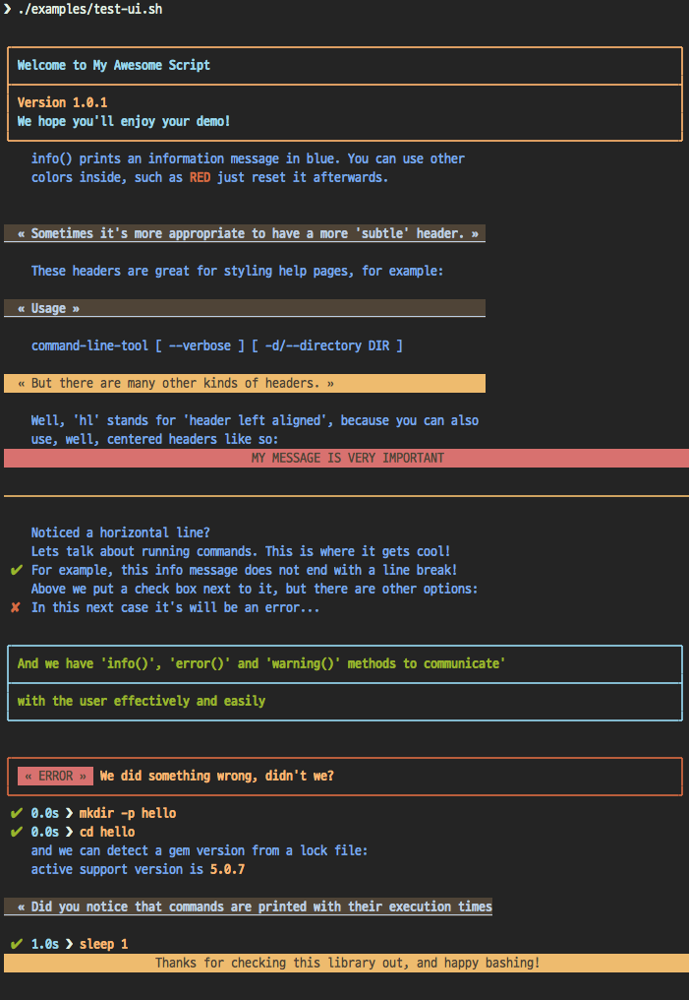

[](https://travis-ci.org/kigster/bashmatic)

# BashMatic

> #### We would like to thank the Homebase Engineering Team for open-sourcing the predecessor of this library (named lib-bash). Note that [Homebase is Hiring in San Francisco, CA and Houston, TX](https://joinhomebase.com/careers/).

<!-- TOC START min:2 max:4 link:true update:true -->
- [Reusable BASH Components for UI, Runtime, Ruby, Database and More](#reusable-bash-components-for-ui-runtime-ruby-database-and-more)
  - [Installation](#installation)
  - [Whats Included?](#whats-included)
    - [Runtime Framework](#runtime-framework)
    - [Examples of Runtime Framework](#examples-of-runtime-framework)
    - [UI Drawing / Output functions](#ui-drawing--output-functions)
    - [Other Utilities](#other-utilities)
- [Usage](#usage)
  - [Integrating With Your Code](#integrating-with-your-code)
    - [Using Provided Installer / Boostrapper](#using-provided-installer--boostrapper)
    - [Custom Installer](#custom-installer)
  - [Some Tips on Writing Shell Scripts](#some-tips-on-writing-shell-scripts)
  - [The List of Available Functions](#the-list-of-available-functions)
  - [Naming Conventions](#naming-conventions)
  - [Writing tests](#writing-tests)
- [Helpful Scripts](#helpful-scripts)
  - [Changing OSX Underscan for Old Monitors](#changing-osx-underscan-for-old-monitors)
  - [Contributing](#contributing)

<!-- TOC END -->

## Reusable BASH Components for UI, Runtime, Ruby, Database and More

Welcome to **BashMatic** — an ever growing collection of scripts and mini-bash frameworks for doing all sorts of things quickly and efficiently.

We have adopted the [Google Bash Style Guide](https://google.github.io/styleguide/shell.xml), and it's recommended that anyone committing to this repo reads the guides to understand the conventions, gotchas and anti-patterns.

### Whats Included?

There is a ton of useful scripts, functions, shortcuts and frameworks that make programming BASH fun. At least for me they do!

#### Runtime Framework

One of the core tenets of this library is it's "runtime" framework, which offers a way to run and display commands as they run, while having a fine-grained control over the following:

 * What happens when one of the commands fails? Options include:
   * Ignore and continue (default) — *continue-on-error*
   * Ask the user if she wants to proceed — *ask-on-error*
   * Abort the entire run — *abort-on-error*.
 * How is command output displayed?
   * Is it swallowed for compactness, and only shown if there is an error? (default) — *show-output-off*
   * Or is it shown regardless? — *show-output-on*
 * Should commands actually run (*dry-run-off*), or simply be printed? (*dry-run-on*).

#### Examples of Runtime Framework

> NOTE, in the following examples we assume you installed the library into your project's folder as `.bashmatic` (a "hidden" folder starting with a dot).

Programming style used in this project lends itself nicely to using a DSL-like approach to shell programming.  For example, in order to configure the behavior of the run-time framework (see below) you would run the following command:

```bash
#!/usr/bin/env bash
# (See below on the location of .bashmatic and ways to install it)
source .bashmatic/Loader.bash

# configure global behavior of all run() invocations
run::set-all abort-on-error show-output-off

run "git clone https://gthub.com/user/rails-repo rails"
run "cd rails"
run "bundle check || bundle install"

# the following configuration only applies to the next invocation of `run()`
# and then resets back to `off`
run::set-next show-output-on
run "bundle exec rspec"
```

You can reliably install gems or brew packages:

```bash
#!/usr/bin/env bash
source .bashmatic/lib/Loader.bash
lib::gem::install sym 1.3.0
lib::brew::install::package curl
sym_version=$(lib::gem::version sym)
echo "Version installed is ${sym_version}"
```

The output from the above script would be something like this:

```
    installing sym (2.8.4)...
 ✔︎  3.1s ❯ gem install sym --version 2.8.4 --no-ri --no-rdoc --force --quiet
 ✔︎  1.3s ❯ gem list > /tmp/gem_list.txt
 ✔︎  checking brew package curl
Version installed is 2.8.2
```

You can shorten URLs using Bitly:

```bash
lib::url::shorten https://raw.githubusercontent.com/kigster/bashmatic/master/bin/install
# http://bit.ly/2IIPNE1
```

And most importantly, you can use our fancy UI drawing routines to communicate with the user, which are based on familiar HTML constructs, such as `h1`, `h2`, `hr`, etc.

#### UI Drawing / Output functions

Here is another example where we are deciding whether to print something based on whether the output is a proper terminal (and not a pipe or redirect):

```
lib::output::is_tty && h1 "Yay For Terminals!"
```

The above reads more like a high level language like Ruby or Python than Shell. That's because BASH is more powerful than most people think.

There is an [example script](examples/test-ui.sh) that demonstrates the capabilities of BashMatic.

If you ran it, below is what you would see (although your colors may vary depending on what color scheme and font you use for your terminal).



#### Other Utilities

The utilities contained herein are of various types, such as:

 * array helpers, such as `array-contains-element` function
 * version helpers, such as functions `lib::util::ver-to-i` which convert a string version like '1.2.0' into an integer that can be used in comparisons; another function `lib::util::i-to-ver` converts an integer back into the string format. This is used, for example, by the auto-incrementing Docker image building tools available in [`docker.sh`](lib/docker.sh)
 * ruby version helpers that can extract curren gem version from either `Gemfile.lock` or globally installed gem list
 * [AWS helpers](lib/aws.sh), requires `awscli` and credentials setup.
 * [output helpers](lib/output.sh), such as colored boxes, header and lines
 * [file helpers](lib/file.sh)
 * [docker helpers](lib/docker.sh)
 * [ruby](lib/ruby.sh), [sym](lib/sym.sh) (encryption) and [utility](lib/utility.sh) helpers
 * and finally, [*LibRun*](lib/runtime.sh) — a BASH runtime framework that executes commands, while measuring their duration and following a set of flags to decide what to do on error, and so on.

Each library will have a set of private functions, typically named `__lib::util::blah`, and public functions, named as `lib::util::foo`, with shortcuts such as `foo` created when makes sense.

----

## Usage

There are a couple of ways that you can install and use this library.

   1. One is doing a simple manual `git clone`, and then "sourcing" the main `lib/Loader.bash` file from one of your "dotfiles".

   2. However, we find that it often more useful to integrate **BashMatic** with other projects, so that they can build their own internal BASH tooling using all the goodies in this library. This of this method as a better version of "git submodules".

### 1. Manual Install

```bash
cd ~/workspace
git clone https://github.com/kigster/bashmatic
source ~/workspace/bashmatic/lib/Loader.bash
```

### 2. Integrating With Your Project

**BashMatic** comes with a clever installer that can be used to install it into any subfolder of an existing project.0

Here is an example of how you could integrate it directly into an existing repo:

```bash
cd ~/workspace/my-project
curl -fsSL http://bit.ly/bashmatic-bootstrap | /usr/bin/env bash
```


The installer above will do the following:

 * Checkout `bashmatic` repo into a folder above the current project — i.e. `../bashmatic`
 * If your project already has a `bin` folder — it's used, otherwise it's created.
 * The script will then create a symlink `./bin/bashmatic` pointing to `../bashmatic/lib`.
 * At this point, you should be able to source the library with `source bin/bashmatic/Loader.bash` and have all of the tools available to you.

#### Custom Installer

Alternatively, you can always do something like this instead:

```bash
git clone https://github.com/kigster/bashmatic .bashmatic
source .bashmatic/lib/Loader.bash
# Now all functions are availble to you.
```

### Some Tips on Writing Shell Scripts

Some bash files exists as libraries to be "sourced in", and others exist as scripts to be run. But users won't always know what is what, and may try to source in a script that shoudl be run, or vice versa — run a script that should be sourced in.

What do you, programmer, do to educate the user about correct usage of your script/library?

Here is one method:

```bash
#!/usr/bin/env bash
# If you want to be able to tell if the script is run or sourced:
( [[ -n ${ZSH_EVAL_CONTEXT} && ${ZSH_EVAL_CONTEXT} =~ :file$ ]] || \
  [[ -n $BASH_VERSION && $0 != "$BASH_SOURCE" ]]) && __ran_as_script=0 || __ran_as_script=1

export __ran_as_script
(( $__ran_as_script )) && {
  echo; printf "This script should be run, not sourced.${clr}\n"
  echo; exit 1
}
```

This method sets the variable `$__ran_as_script` to either 1 (if the script is *sourced in*) and 0 if the script is run. Since both values are numeric we can use BASH's numeric expansion, which evaluates as follows:

```bash
(( 1 )) && echo "1 is true and therefore this is printed"
(( 0 )) && echo "0 is false, so this statement is not printed"
```

If you run the above, you should see only one line printed:

```
1 is true and therefore this is printed
```

### The List of Available Functions

These are too many to describe each in detail, but if you type:

```bash
$ lib::<tab><tab>
```

You will see all the functions. They are:

```
lib::array::complain-unless-includes        lib::gem::uninstall
lib::array::contains-element                lib::gem::version
lib::array::exit-unless-includes            lib::osx::display::change-underscan
lib::bash-source                            lib::osx::ramdisk::mount
lib::brew::cache-reset                      lib::osx::ramdisk::unmount
lib::brew::cask::is-installed               lib::output::color::off
lib::brew::cask::list                       lib::output::color::on
lib::brew::install::cask                    lib::output::is_pipe
lib::brew::install::package                 lib::output::is_redirect
lib::brew::install::packages                lib::output::is_terminal
lib::brew::package::is-installed            lib::output::is_tty
lib::brew::package::list                    lib::progress::bar
lib::brew::reinstall::packages              lib::ruby::bundler-version
lib::brew::relink                           lib::ruby::gemfile-lock-version
lib::brew::setup                            lib::ruby::version
lib::brew::uninstall::package               lib::run
lib::brew::uninstall::packages              lib::run::ask
lib::brew::upgrade                          lib::run::inspect
lib::color::disable                         lib::run::inspect-variable
lib::color::enable                          lib::run::inspect-variables
lib::db::dump                               lib::run::inspect-variables-that-are
lib::db::psql-args                          lib::run::inspect::set-skip-false-or-blank
lib::db::psql::args::default                lib::run::print-variable
lib::db::psql::args::app                    lib::run::print-variables
lib::db::psql::args::maint                  lib::run::variables-ending-with
lib::db::rails::schema::checksum            lib::run::variables-starting-with
lib::db::rails::schema::file                lib::run::with-min-duration
lib::db::restore                            lib::ssh::load-keys
lib::db::top                                lib::time::date-from-epoch
lib::docker::abort_if_down                  lib::time::epoch-to-iso
lib::docker::actions::build                 lib::time::epoch-to-local
lib::docker::actions::clean                 lib::time::epoch::minutes-ago
lib::docker::actions::pull                  lib::url::downloader
lib::docker::actions::push                  lib::url::shorten
lib::docker::actions::setup                 lib::user
lib::docker::actions::start                 lib::user::finger::name
lib::docker::actions::stop                  lib::user::gitconfig::email
lib::docker::actions::tag                   lib::user::gitconfig::name
lib::docker::actions::up                    lib::user::host
lib::docker::actions::update                lib::user::my::ip
lib::docker::build::container               lib::user::my::reverse-ip
lib::docker::last-version                   lib::user::username
lib::docker::next-version                   lib::util::append-to-init-files
lib::file::exists_and_newer_than            lib::util::arch
lib::file::install_with_backup              lib::util::checksum::files
lib::file::last-modified-date               lib::util::functions-matching
lib::file::last-modified-year               lib::util::i-to-ver
lib::gem::cache-installed                   lib::util::is-numeric
lib::gem::cache-refresh                     lib::util::lines-in-folder
lib::gem::ensure-gem-version                lib::util::remove-from-init-files
lib::gem::gemfile::version                  lib::util::shell-init-files
lib::gem::global::latest-version            lib::util::shell-name
lib::gem::global::versions                  lib::util::ver-to-i
lib::gem::install                           lib::util::whats-installed
```

### Naming Conventions

We use the following naming conventions:

 1. Namespaces are separated by `::`
 2. Private functions are prefixed with `__`, eg `__lib::output::hr1`
 3. Public functions do not need to be namespaced, or be prefixed with `__`

### Writing tests

We are using [`bats`](https://github.com/sstephenson/bats.git) for unit testing.

While not every single function is tested (far from it), we do try to add tests to the critical ones.

Please see [existing tests](https://github.com/kigster/bashmatic/tree/master/test) for the examples.

## Helpful Scripts

### Changing OSX Underscan for Old Monitors

If you are stuck working on a monitor that does not support switching digit input from TV to PC, NOR does OS-X show the "underscan" slider in the Display Preferences, you may be forced to change the underscan manually. The process is a bit tricky, but we have a helpful script to do that:

```bash
$ source lib/Loader.bash
$ lib::osx::display::change-underscan 5
```

This will reduce underscan by 5% compared to the current value. The total value is 10000, and is stored in the file `/var/db/.com.apple.iokit.graphics`. The tricky part is determining which of the display entries map to your problem monitor. This is what the script helps with.

Do not forget to restart after the change.

Acknowledgements: the script is an automation of the method offered on [this blog post](http://ishan.co/external-monitor-underscan).

### Contributing

Submit a pull request!
