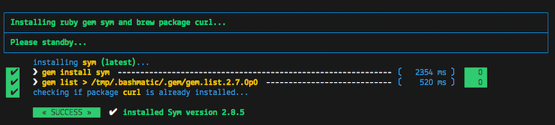
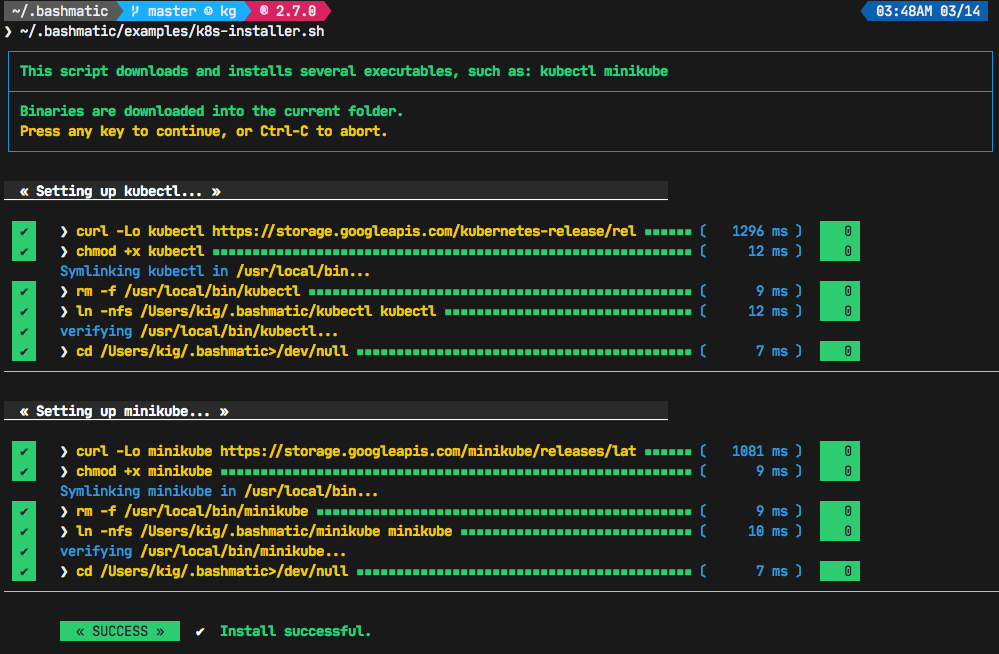
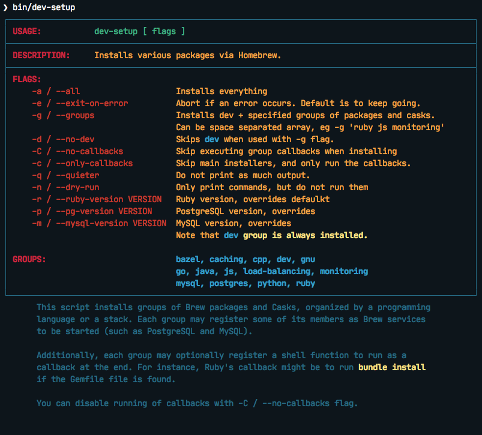

[](https://travis-ci.org/kigster/bashmatic)


# Bashmatic

_Bashmatic®_ is an ever-growing framework of Bash Script runners, auto-retrying, repeatable, DSL-controlled functions for every occasion, from drawing boxes, lines, headers, to showing progress bars, getting user input, and more.

**_Bashmatic®_ is meant to be used primarily with Mac OS-X, although some functions will also work under Linux.**.

Start exploring _Bashmatic®_ below with our [examples section](#usage-examples-for-the-impatient). When you are ready, the complete entire set of pubic functions (nearly 500 of those) can be found in the [functions index page](FUNCTIONS.md).

**For quick installation instructions, please [see the corresponding section](#installing-bashmatic)**.

And, finally, don't worry, **_Bashmatic®_** is totally open source and free to use and extend. We just like the way it looks with a little **®** 😂.
## Table of Contents

* [Table of Contents](#table-of-contents)
* [Project Motivation](#project-motivation)
* [What's The Fuss? Another BASH framework?](#whats-the-fuss-another-bash-framework)
  * [Usage Examples](#usage-examples)
    * [Gem and Brew Install](#gem-and-brew-install)
  * [Installing `kubectl` and `minikube` into `/usr/local/bin`](#installing-kubectl-and-minikube-into-usrlocalbin)
  * [Mac OSX Developer Setup](#mac-osx-developer-setup)
* [Installing Bashmatic](#installing-bashmatic)
  * [Bootstrapping _Bashmatic®_ using `curl`](#bootstrapping-bashmatic-using-curl)
  * [Installing Manually](#installing-manually)
* [Usage](#usage)
  * [Function Naming Convention Unpacked](#function-naming-convention-unpacked)
  * [Seeing All Functions](#seeing-all-functions)
  * [Seeing Specific Functions](#seeing-specific-functions)
  * [Various Modules](#various-modules)
  * [Key Modules Explained](#key-modules-explained)
    * [1. Runtime](#1-runtime)
      * [Runtime Framework in Depth](#runtime-framework-in-depth)
      * [Examples of Runtime Framework](#examples-of-runtime-framework)
    * [2. Output Modules](#2-output-modules)
      * [Output Components](#output-components)
      * [Output Helpers](#output-helpers)
    * [3. Package management: Brew and RubyGems](#3-package-management-brew-and-rubygems)
    * [4. Shortening URLs and Github Access](#4-shortening-urls-and-github-access)
      * [Github Access](#github-access)
    * [5. File Helpers](#5-file-helpers)
    * [6. Array Helpers](#6-array-helpers)
    * [7. Utilities](#7-utilities)
    * [8. Ruby and Ruby Gems](#8-ruby-and-ruby-gems)
      * [Gem Helpers](#gem-helpers)
    * [9. Additional Helpers](#9-additional-helpers)
* [How To...](#how-to)
  * [Write new DSL in the _Bashmatic®_ Style](#write-new-dsl-in-the-bashmatic-style)
  * [How can I test if the function was ran as part of a script, or "sourced-in"?](#how-can-i-test-if-the-function-was-ran-as-part-of-a-script-or-sourced-in)
  * [How do I run unit tests for Bashmatic?](#how-do-i-run-unit-tests-for-bashmatic)
  * [How can I change the underscan or overscan for an old monitor?](#how-can-i-change-the-underscan-or-overscan-for-an-old-monitor)
  * [Contributing](#contributing)

_Bashmatic®_ is a collection of BASH convenience functions that make BASH programming fun (again? forever? always?).

## Project Motivation

This project was born out of a simple realization made by several very senior and highly experienced engineers, that:

 * It is often easier to use BASH for writing things like universal **installers**, a.k.a. **setup scripts**, **uploaders**, wrappers for all sorts of functionality, such as **NPM**, **rbenv**, installing gems, rubies, using AWS, deploying code, etc.

 * BASH function's return values lend themselves nicely to a compact DSL ([domain specific language](https://en.wikipedia.org/wiki/Domain-specific_language)) where multiple functions can be chained by logical AND `&&` and OR `||` to provide a very compact execution logic. Most importantly, we think that this logic is **extremely easy to read and understand.**

Despite the above points, it is also generally accepted that:

 * A lot of BASH scripts are very poorly written and hard to read and understand.

 * It's often difficult to understand what the hell is going on while the script is running, because either its not outputting anything useful, OR it's outputting way too much.

 * When BASH errors occur, shit generally hits the fan and someone decides that they should rewrite the 20-line BASH script in C++ or Go, because, well, it's a goddamn BASH script and it ain't working.

**_Bashmatic_'s goal is to make BASH programming both fun, consistent, and provide plenty of visible output to the user so that there is no mystery as to what is going on.**

## What's The Fuss? Another BASH framework?

BASH is know to be too verbose and unreliable. We beg to differ.

This is why we wanted to start this README with a couple of examples.

### Usage Examples

#### Gem and Brew Install

Just look at this tiny, five-line script:

```bash
#!/usr/bin/env bash
source ~/.bashmatic/init.sh

h2 "Installing ruby gem sym and brew package curl..." \
   "Please standby..."
gem.install "sym" && brew.install.package "curl" && \
  success "installed sym ruby gem, version $(gem.version sym)"
```

Results in this detailed and, let's be honest, *gorgeous* ASCII output:



Tell me you are not at all excited to start writing complex installation flows in BASH right away?

Not only you get pretty output, but you can each executed command, it's exit status, whether it's been successful (green/red), as well each command's bloody duration in milliseconds. What's not to like?!? 😂

Still not convinced?

Take a look at a more comprehensive example next.

### Installing `kubectl` and `minikube` into `/usr/local/bin`

We provided an example script in [`examples/k8s-installer.sh`](examples/k8s-installer.sh). Please click and take a look at the source.

Here is the output of running this script:



Why do we think this type of installer is pretty awesome, compared to a silent but deadly shell script that "Jim-in-the-corner" wrote and now nobody understands?

Because:

1. The script goes out of its way to over-communicate what it does to the user.
2. It allows and reminds about a clean getaway (Ctrl-C)
3. It shares the exact command it runs and its timings so that you can eyeball issues like network congestions or network addresses, etc.
4. It shows in green exit code '0' of each command. Should any of the commands fail, you'll see it in red.
5. It's source code is terse, explicit, and easy to read. There is no magic. Just BASH functions.

> If you need to create a BASH installer, _Bashmatic®_ offers some incredible time savers.

Let's get back to the Earth, and talk about how to install Bashmatic, and how to use it in more detail right after.

### Mac OSX Developer Setup

This final example is not just an example — it's a working functioning script that can be used to install a bunch of cool stuff on your laptop. It's located in [`bin/dev-setup`](bin/dev/setup) and has many CLI flags:



Try running the following to install Ruby 2.7.1 and supporting tools:

```bash
~/.bashmatic/bin/dev-setup -d -g ruby -r 2.7.1
```

## Installing Bashmatic

Perhaps the easiest way to install _Bashmatic®_ is using this boot-strapping script.

### Bootstrapping _Bashmatic®_ using `curl`

First, make sure that you have Curl installed, run `which curl` to see. Then copy/paste this command into your Terminal (NOTE: you can change 1-0-1 to a version you'd like to install):

```bash
❯ bash -c "$(curl -fsSL http://bit.ly/bashmatic-1-0-2)"
```

This not only will check out _bashmatic®_ into `~/.bashmatic`, but will also add the enabling hook to your `~/.bashrc` file.

Restart your shell, and make sure that when you type `bashmatic.version` in the command line (and press Enter) you see the version number printed like so:

```bash
❯ bashmatic.version
1.0.0
```

If you get an error, perhaps _Bashmatic®_ did not properly install.

### Installing Manually

For the impatient, here is how to install _Bashmatic®_ very quickly and easily. You can add the following script to your `~/.bashrc`  or any other script:

```bash

[[ -d ${HOME}/._bashmatic®_ ]] || {
  git clone https://github.com/kigster/bashmatic.git ~/.bashmatic
}
source ~/.bashmatic/init.sh
```

Finally, to ensure _Bashmatic®_ loads every time you login, run the following command:

```bash
bashmatic.load-at-login
```

When you run the `bashmatic.load-at-login` function, it will add a _bashmatic®_ hook to one of your BASH initialization files, so all of its functions are available in your shell.

Note — you can always reload _Bashmatic®_ with `bashmatic.reload` function.

## Usage

Welcome to **Bashmatic** — an ever growing collection of scripts and mini-bash frameworks for doing all sorts of things quickly and efficiently.

We have adopted the [Google Bash Style Guide](https://google.github.io/styleguide/shell.xml), and it's recommended that anyone committing to this repo reads the guides to understand the conventions, gotchas and anti-patterns.

### Function Naming Convention Unpacked

_Bashmatic®_ provides a large number of functions, which are all loaded in your current shell. The functions are split into two fundamental groups:

 * Functions with names beginning with a `.` are considered "private" functions, for example `.run.env` and `.run.initializer`
 * All other functions are considered public.

The following conventions apply to all functions:

 * We use the "dot" for separating namespaces, hence `git.sync` and `gem.install`.
 * Function names should be self-explanatory and easy to read.
 * DO NOT abbreviate words.
 * All public functions must be written defensively: i.e. if the function is called from the Terminal without any arguments, and it requires arguments, the function *must print its usage info* and a meaningful error message.

For instance:

```bash
❯ gem.install
┌──────────────────────────────────────────────────────────────────┐
│  « ERROR »  Error — gem name is required as an argument          │
└──────────────────────────────────────────────────────────────────┘
```

Now let's run it properly:

```bash
❯ gem.install simple-feed
       installing simple-feed (latest)...
  ✔︎    ❯ gem install simple-feed   ▪▪▪▪▪▪▪▪▪▪▪▪▪▪▪▪▪▪▪▪▪〔   5685 ms 〕    0
  ✔︎    ❯ gem list > /tmp/.bashmatic/.gem/gem.list ▪▪▪▪▪▪〔    503 ms 〕    0
```


The naming convention we use is a derivative of Google's Bash StyleGuide, using `.` to separate BASH function namespaces instead of much more verbose `::`.

### Seeing All Functions

After running the above, run `bashmatic.functions` function to see all available functions. You can also open the [FUNCTIONS.md](FUNCTIONS.md) file to see the alphabetized list of all 422 functions.

### Seeing Specific Functions

To get a list of module or pattern-specific functions installed by the framework, run the following:

```bash
❯ bashmatic.functions-from pattern [ columns ]
```
For instance:

```bash
❯ bashmatic.functions-from docker 2
docker.abort-if-down                    docker.build.container
docker.actions.build                    docker.containers.clean
.......
docker.actions.update
```

### Various Modules

You can list various modules by listing the `lib` sub-directory of the `~/.bashmatic` folder.

Note how we use _Bashmatic®_ helper `columnize [ columns ]` to display a long list in five columns.

```bash
❯ ls -1 ~/.bashmatic/lib | sed 's/\.sh//g' | columnize 5
7z                deploy            jemalloc          runtime-config    time
array             dir               json              runtime           trap
audio             docker            net               set               url
aws               file              osx               set               user
_bashmatic®_         ftrace            output            settings          util
brew              gem               pids              shell-set         vim
caller            git-recurse-updat progress-bar      ssh               yaml
color             git               ruby              subshell
db                sedx             run               sym
```

### Key Modules Explained

At a high level, the following modules are provided, in order of importance:

#### 1. Runtime

The following files provide this functionality:

 * `lib/run.sh`
 * `lib/runtime.sh`
 * `lib/runtime-config.sh`.

These collectively offer the following functions:

```bash
❯ bashmatic.functions-from 'run*'

run                                            run.set-next
run.config.detail-is-enabled                   run.set-next.list
run.config.verbose-is-enabled                  run.ui.ask
run.inspect                                    run.ui.ask-user-value
run.inspect-variable                           run.ui.get-user-value
run.inspect-variables                          run.ui.press-any-key
run.inspect-variables-that-are                 run.ui.retry-command
run.inspect.set-skip-false-or-blank            run.variables-ending-with
run.on-error.ask-is-enabled                    run.variables-starting-with
run.print-variable                             run.with.minimum-duration
run.print-variables                            run.with.ruby-bundle
run.set-all                                    run.with.ruby-bundle-and-output
run.set-all.list
```

Using these functions you can write powerful shell scripts that display each command they run, it's status, duration, and can abort on various conditions. You can ask the user to confirm, and you can show a user message and wait for any key pressed to continue.

To learn more about this key module, please go to the [Runtime Framework](#runtime-framework) section.

##### Runtime Framework in Depth

One of the core tenets of this library is it's "runtime" framework, which offers a way to run and display commands as they run, while having a fine-grained control over the following:

 * What happens when one of the commands fails? Options include:
   * Ignore and continue (default) — *continue-on-error*
   * Ask the user if she wants to proceed — *ask-on-error*
   * Abort the entire run — *abort-on-error*.
 * How is command output displayed?
   * Is it swallowed for compactness, and only shown if there is an error? (default) — *show-output-off*
   * Or is it shown regardless? — *show-output-on*
 * Should commands actually run (*dry-run-off*), or simply be printed? (*dry-run-on*).

##### Examples of Runtime Framework

> NOTE, in the following examples we assume you installed the library into your project's folder as `.bashmatic` (a "hidden" folder starting with a dot).

Programming style used in this project lends itself nicely to using a DSL-like approach to shell programming.  For example, in order to configure the behavior of the run-time framework (see below) you would run the following command:

```bash
#!/usr/bin/env bash

# (See below on the location of ._bashmatic®_ and ways to install it)
source ~/.bashmatic/init.sh

# configure global behavior of all run() invocations
run.set-all abort-on-error show-output-off

run "git clone https://gthub.com/user/rails-repo rails"
run "cd rails"
run "bundle check || bundle install"

# the following configuration only applies to the next invocation of `run()`
# and then resets back to `off`
run.set-next show-output-on
run "bundle exec rspec"
```

And most importantly, you can use our fancy UI drawing routines to communicate with the user, which are based on familiar HTML constructs, such as `h1`, `h2`, `hr`, etc.

#### 2. Output Modules

The `lib/output.sh` module does all of the heavy lifting with providing many UI elements, such as frames, boxes, lines, headers, and many more.

Here is the list of functions in this module:

```bash
❯ bashmatic.functions-from output 3
abort                          error:                         left-prefix
ascii-clean                    h.black                        ok
box.blue-in-green              h.blue                         okay
box.blue-in-yellow             h.green                        output.color.off
box.green-in-cyan              h.red                          output.color.on
box.green-in-green             h.yellow                       output.is-pipe
box.green-in-magenta           h1                             output.is-redirect
box.green-in-yellow            h1.blue                        output.is-ssh
box.magenta-in-blue            h1.green                       output.is-terminal
box.magenta-in-green           h1.purple                      output.is-tty
box.red-in-magenta             h1.red                         puts
box.red-in-red                 h1.yellow                      reset-color
box.red-in-yellow              h2                             reset-color:
box.yellow-in-blue             h2.green                       screen-width
box.yellow-in-red              h3                             screen.height
box.yellow-in-yellow           hdr                            screen.width
br                             hl.blue                        shutdown
center                         hl.desc                        stderr
columnize                      hl.green                       stdout
command-spacer                 hl.orange                      success
cursor.at.x                    hl.subtle                      test-group
cursor.at.y                    hl.white-on-orange             ui.closer.kind-of-ok
cursor.down                    hl.white-on-salmon             ui.closer.kind-of-ok:
cursor.left                    hl.yellow                      ui.closer.not-ok
cursor.rewind                  hl.yellow-on-gray              ui.closer.not-ok:
cursor.right                   hr                             ui.closer.ok:
cursor.up                      hr.colored                     warn
debug                          inf                            warning
duration                       info                           warning:
err                            info:
error                          left
```

Note that some function names end with `:` — this indicates that the function outputs a new-line in the end. These functions typically exist together with their non-`:`-terminated counter-parts.  If you use one, eg, `inf`, you are then supposed to finish the line by providing an additional output call, most commonly it will be one of `ok:`, `ui.closer.not-ok:` and `ui.closer.kind-of-ok:`.

Here is an example:

```bash
function valid-cask()  { sleep 1; return 0; }
function verify-cask() {
  inf "verifying brew cask ${1}...."
  if valid-cask ${1}; then
    ui.closer.ok:
  else
    ui.closer.not-ok:
  fi
}
```

When you run this, you should see something like this:

```bash
 ❯ verify-cask TextMate
  ✔︎    verifying brew cask TextMate....
```

In the above example, you see the checkbox appear to the left of the text. In fact, it appears a second after, right as `sleep 1` returns. This is because this paradigm is meant for wrapping constructs that might succeed or fail.

If we change the `valid-cask` function to return a failure:

```bash
function valid-cask()  { sleep 1; return 1; }
```

Then this is what we'd see:

```bash
❯ verify-cask TextMate
  ✘    verifying brew cask TextMate....
```

##### Output Components

Components are BASH functions that draw something concrete on the screen. For instance, all functions starting with `box.` are components, as are `h1`, `h2`, `hr`, `br` and more.

```bash
❯ h1 Hello

┌─────────────────────────────────────────────────────────────────────────────────┐
│ Hello                                                                           │
└─────────────────────────────────────────────────────────────────────────────────┘
```

These are often named after HTML elements, such as `hr`, `h1`, `h2`, etc.

##### Output Helpers

Here is another example where we are deciding whether to print something based on whether the output is a proper terminal (and not a pipe or redirect):

```
output.is-tty && h1 "Yay For Terminals!"
```

The above reads more like a high level language like Ruby or Python than Shell. That's because BASH is more powerful than most people think.

There is an [example script](examples/test-ui.sh) that demonstrates the capabilities of Bashmatic.

If you ran the script, you should see the output shown [in this screenshot](.bashmatic.png). Your colors may vary depending on what color scheme and font you use for your terminal.

#### 3. Package management: Brew and RubyGems

You can reliably install ruby gems or brew packages with the following syntax:

```bash
#!/usr/bin/env bash

source ~/.bashmatic/init.sh

h2 "Installing ruby gem sym and brew package curl..." \
   "Please standby..."

gem.install sym
brew.install.package curl

success "installed Sym version $(gem.version sym)"
```


When you run the above script, you shyould seee the following output:


#### 4. Shortening URLs and Github Access

You can shorten URLs on the command line using Bitly, but for this to work, you must set the following environment variables in your shell init:

```bash
export BITLY_LOGIN="<your login>"
export BITLY_API_KEY="<your api key>"
```

Then you can run it like so:

```bash
❯ url.shorten https://raw.githubusercontent.com/kigster/bashmatic/master/bin/install
# http://bit.ly/2IIPNE1
```

##### Github Access

There are a couple of Github-specific helpers:

```bash
github.clone                                   github.setup
github.org                                     github.validate
```

For instance:

```bash
❯ github.clone sym
  ✘    Validating Github Configuration...

       Please enter the name of your Github Organization:
       ❯ kigster

┌───────────────────────────────────────────────────────────────────────────────────┐
│ Your github organization was saved in your ~/.gitconfig file.                     │
├───────────────────────────────────────────────────────────────────────────────────┤
│ To change it in the future, run: github.org new-organization                      │
└───────────────────────────────────────────────────────────────────────────────────┘

  ✔︎    ❯ git clone git@github.com:kigster/sym ▪▪▪▪▪▪▪▪▪▪▪▪▪▪▪▪▪▪▪▪▪▪▪〔    931 ms 〕    0
```


#### 5. File Helpers

```bash
❯ bashmatic.functions-from file

file.exists_and_newer_than                    file.list.filter-non-empty
file.gsub                                     file.size
file.install-with-backup                      file.size.mb
file.last-modified-date                       file.source-if-exists
file.last-modified-year                       file.stat
file.list.filter-existing
```

For instance, `file.stat` offers access to the `fstat()` C-function:

```bash
 ❯ file.stat README.md st_size
22799
```

#### 6. Array Helpers

```bash
❯ bashmatic.functions-from array

array.to.bullet-list                             array.includes
array.has-element                        array.includes-or-exit
array.to.csv                                     array.from.stdin
array-join                                    array.join
array-piped                                   array.to.piped-list
array.includes-or-complain
```

For instance:

```bash
❯ declare -a farm_animals=(chicken duck rooster pig)
❯ array.to.bullet-list ${farm_animals[@]}
 • chicken
 • duck
 • rooster
 • pig
❯ array.includes "duck" "${farm_animals[@]}" && echo Yes || echo No
Yes
❯ array.includes  "cow" "${farm_animals[@]}" && echo Yes || echo No
No
```

#### 7. Utilities

The utilities module has the following functions:

```bash
❯ bashmatic.functions-from util

pause.long                                    util.install-direnv
pause                                         util.is-a-function
pause.short                                   util.is-numeric
pause.medium                                util.is-variable-defined
util.append-to-init-files                     util.lines-in-folder
util.arch                                     util.remove-from-init-files
util.call-if-function                         util.shell-init-files
util.checksum.files                           util.shell-name
util.checksum.stdin                           util.ver-to-i
util.functions-starting-with                       util.whats-installed
util.generate-password                        watch.ls-al
```

For example, version helpers can be very handy in automated version detection, sorting and identifying the latest or the oldest versions:

```bash
❯ util.ver-to-i '12.4.9'
112004009
❯ util.i-to-ver $(util.ver-to-i '12.4.9')
12.4.9

```

#### 8. Ruby and Ruby Gems

Ruby helpers abound:

```bash
❯ bashmatic.functions-from ruby

bundle.gems-with-c-extensions                 ruby.install-ruby-with-deps
interrupted                                   ruby.install-upgrade-bundler
ruby.bundler-version                          ruby.installed-gems
ruby.compiled-with                            ruby.kigs-gems
ruby.default-gems                             ruby.linked-libs
ruby.full-version                             ruby.numeric-version
ruby.gemfile-lock-version                     ruby.rbenv
ruby.gems                                     ruby.rubygems-update
ruby.gems.install                             ruby.stop
ruby.gems.uninstall                           ruby.top-versions
ruby.init                                     ruby.top-versions-as-yaml
ruby.install                                  ruby.validate-version
ruby.install-ruby
```

From the obvious `ruby.install-ruby <version>` to incredibly useful `ruby.top-versions <platform>` — which, using rbenv and ruby_build plugin, returns the most recent minor version of each major version upgrade, as well as the YAML version that allows you to pipe the output into your `.travis.yml` to test against each major version of Ruby, locked to the very latest update in each.

```bash
❯ ruby.top-versions
2.0.0-p648
2.1.10
2.2.10
2.3.8
2.4.9
2.5.7
2.6.5
2.7.0
2.8.0-dev

❯ ruby.top-versions jruby
jruby-1.5.6
jruby-1.6.8
jruby-1.7.27
jruby-9.0.5.0
jruby-9.1.17.0
jruby-9.2.10.0

❯ ruby.top-versions mruby
mruby-dev
mruby-1.0.0
mruby-1.1.0
mruby-1.2.0
mruby-1.3.0
mruby-1.4.1
mruby-2.0.1
mruby-2.1.0
```

##### Gem Helpers

These are fun helpers to assist in scripting gem management.

```bash
❯ bashmatic.functions-from gem

g-i                                           gem.gemfile.version
g-u                                           gem.global.latest-version
gem.cache-installed                           gem.global.versions
gem.cache-refresh                             gem.install
gem.clear-cache                               gem.is-installed
gem.configure-cache                           gem.uninstall
gem.ensure-gem-version                        gem.version
```

For instance

```bash
❯ g-i awesome_print
  ✔︎    gem awesome_print (1.8.0) is already installed
❯ gem.version awesome_print
1.8.0
```


#### 9. Additional Helpers

There are plenty more modules, that help with:

 * [Ruby Version Helpers](lib/ruby.sh) and (Ruby Gem Helpers)[lib/gem.sh], that can extract curren gem version from either `Gemfile.lock` or globally installed gem list..
 * [AWS helpers](lib/aws.sh) — requires `awscli` and credentials setup, and offers some helpers to simplify AWS management.

 * [Docker Helpers](lib/docker.sh) — assist with docker image building and pushing/pulling
 * [Sym](lib/sym.sh) — encryption with the gem called [`sym`](https://github.com/kigster/sym)

And many more.

See the full function index with the function implementation body in the [FUNCTIONS.md](FUNCTIONS.md) index.

----

## How To...

### Write new DSL in the _Bashmatic®_ Style

The following example is the actual code from a soon to be integrated AWS credentials install script. This code below checks that a user has a local `~/.aws/credentials` file needed by the `awscli`, and in the right INI format. If it doesn't find it, it checks for the access key CSV file in the `~/Downloads` folder, and converts that if found. Now, if even that is not found, it prompts the user with instructions on how to generate a new key pair on AWS IAM website, and download it locally, thereby quickly converting and installing it as a proper credentials file. Not bad, for a compact BASH script, right? (of course, you are not seeing all of the involved functions, only the public ones).

```bash
# define a new function in AWS namespace, related to credentials.
# name of the function is self-explanatory: it validates credentials
# and exits if they are invalid.
aws.credentials.validate-or-exit() {
  aws.credentials.are-valid || {
    aws.credentials.install-if-missing || bashmatic.exit-or-return 1
  }
}

aws.credentials.install-if-missing() {
  aws.credentials.are-present || { # if not present
    aws.access-key.is-present || aws.access-key.download # attempt to download the key
    aws.access-key.is-present && aws.credentials.check-downloads-folder # attempt to find it in ~/Downloads
  }

  aws.credentials.are-present || { # final check after all attempts to install credentials
    error "Unable to find AWS credentials. Please try again." && bashmatic.exit-or-return 1
  }

   bashmatic.exit-or-return 0
}
```

Now, **how would you use it in a script?** Let's say you need a script to upload
something to AWS S3. But before you begin, wouldn't it be nice to verify
that the credentials exist, and if not — help the user install it? Yes it would.

And that is exactly what the code above does, but it looks like a DSL. because
it *is* a DSL.

> This script could be your `bin/s3-uploader`
```bash
  #!/usr/bin/env bash
  # Initialize _Bashmatic®_ in this subshell

  # call the function. It will exit if the user fails to follow instructions
  # and install a proper file.
  aws.credentials.validate-or-exit
  # if we are here, that means that AWS credentials have been found.
  # and we can continue with our script.
```


### How can I test if the function was ran as part of a script, or "sourced-in"?

Some bash files exists as libraries to be "sourced in", and others exist as scripts to be run. But users won't always know what is what, and may try to source in a script that should be run, or vice versa — run a script that should be sourced in.

What do you, programmer, do to educate the user about correct usage of your script/library?

_Bashmatic®_ offers a reliable way to test this:

```bash
#!/usr/bin/env bash
# load library
if [[ -f "${Bashmatic__Init}" ]]; then source "${Bashmatic__Init}"; else source ~/.bashmatic/init.sh; fi
bashmatic.validate-subshell || return 1
```

If you'd rather require a library to be sourced in, but not run, use the code as follows:

```bash
#!/usr/bin/env bash
# load library
if [[ -f "${Bashmatic__Init}" ]]; then source "${Bashmatic__Init}"; else source ~/.bashmatic/init.sh; fi
bashmatic.validate-sourced-in || exit 1
```

### How do I run unit tests for Bashmatic?

The framework comes with a bunch of automated unit tests based on the fantastic framework [`bats`](https://github.com/sstephenson/bats.git).

To run all tests:

```bash
cd ~/.bashmatic
bin/specs
```

While not every single function is tested (far from it), we do try to add tests to the critical ones.

Please see [existing tests](https://github.com/kigster/bashmatic/tree/master/test) for the examples.

### How can I change the underscan or overscan for an old monitor?

If you are stuck working on a monitor that does not support switching digit input from TV to PC, NOR does OS-X show the "underscan" slider in the Display Preferences, you may be forced to change the underscan manually. The process is a bit tricky, but we have a helpful script to do that:

```bash
$ source init.sh
$ change-underscan 5
```

This will reduce underscan by 5% compared to the current value. The total value is 10000, and is stored in the file `/var/db/.com.apple.iokit.graphics`. The tricky part is determining which of the display entries map to your problem monitor. This is what the script helps with.

Do not forget to restart after the change.

Acknowledgements: the script is an automation of the method offered on [this blog post](http://ishan.co/external-monitor-underscan).

### Contributing

Submit a pull request!
